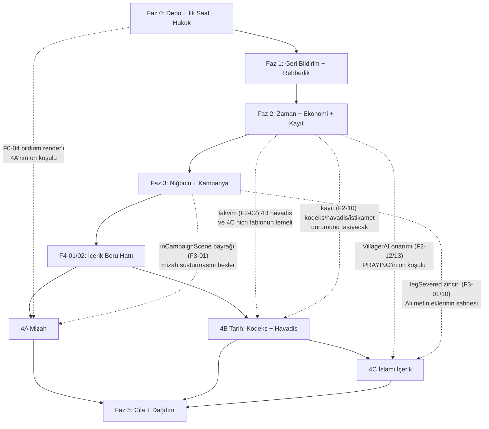

# 06 — Fazlar ve Kabul Planı (Yapım Yol Haritası)

> **Bu doküman ne için:** Bu doküman, "Mülk-i Osmanî: Tımarlı Sipahi 3D" için yazılmış beş tasarım dokümanını (01-akış, 02-mizah, 03-tarih, 04-islam, 05-teknik) **tek bir uygulanabilir yapım planına** çevirir: işleri bağımsız teslim edilebilir 6 faza böler (Faz 0 → Faz 5), her işe kimlik numarası, dosya referansı, dayanak, saat tahmini ve bağımlılık verir; her fazın sonuna denetçinin tek tek işaretleyeceği ölçülebilir kabul kriterleri, yeni test zorunlulukları ve riskleri koyar; tasarım dokümanları arasında tespit edilen 17 çelişkiyi karara bağlar (Bölüm 1 — bu kararlar diğer dokümanların ilgili maddelerini GEÇERSİZ KILAR); fazlar arası bağımlılık grafiğini, evrensel "Definition of Done" kurallarını ve solo geliştirici için takvim önerisini verir. Bu dokümanı uygulayacak geliştirici soru soramayacak; işi bu dokümana göre bağımsız bir denetçi kabul edecektir. `docs/TARIHSEL_SENARYO_VE_GELISTIRME_PLANI.md` (bundan sonra: TARIHSEL) ile çelişmez; onun 13. bölüm yol haritasını (Aşama 0-5) bu projenin doğrulanmış kod gerçekliğine ve 5 tasarım dokümanına göre yeniden keser.

**Sabit kararlar (tartışmasız, tüm fazlar için bağlayıcı):** Kampanya 1396 ilkbaharı → 25 Eylül 1396 Niğbolu (TARIHSEL §5). Tarihsellik etiketi A/B/C/R (TARIHSEL §4.2). İslami içerik Ehl-i Sünnet çizgisinde: Hanefî fıkhı, Mâturîdî itikadı; yalnız sahih/muteber kaynak; uydurma rivayet, mezhep tartışması, modern polemik YOK. Din adamları, ibadet ve dinî değerler ASLA mizah nesnesi olmaz (TARIHSEL §18.1); mizah dünyevi hayatta yaşar. Mevcut mimari korunur: cerrahi değişiklik, aşamalı teslim, büyük yeniden yazım YOK. Dokümanlar Türkçe; kod/commit İngilizce.

**Doğrulanmış temel durum:** `npm test` 97/97 geçiyor; `npm run build` çalışıyor (tek chunk >500kB uyarısı); testler gerçek modülleri import eden entegrasyon testleri. Her fazın kapanış şartı bu iki komutun yeşil kalmasıdır.

**Doküman kısaltmaları:** 01-akış = `01-akis-ve-tutundurma.md`, 02-mizah = `02-mizah-ve-diyalog.md`, 03-tarih = `03-tarih-egitimi.md`, 04-islam = `04-islami-icerik.md`, 05-teknik = `05-teknik-plan.md`. P0-x/P1-x/P2-x kimlikleri 05-teknik'in backlog kimlikleridir; Z/J/K kimlikleri 01-akış'ın karar kimlikleridir.

---

## 1. ÇELİŞKİ ÇÖZÜMÜ (önce oku — bu kararlar diğer dokümanları ezer)

Beş tasarım dokümanı arasında tespit edilen çelişkiler aşağıda karara bağlanmıştır. **Bir tasarım dokümanı ile bu tablo çelişirse bu tablo geçerlidir.** Her karar "hangi dokümanın hangi bölümü geçerli" biçiminde yazılmıştır.

| # | Konu | Çelişki | KARAR (geçerli olan) |
|---|---|---|---|
| **Ç1** | **Kampanya başlangıç tarihi** | 01-akış §2.2 "1 Mart 1396" der; 04-islam §2.2.1/§2.4.1 "1 Nisan 1396 = 22 Cemâziyelâhir 798 = Cumartesi" çıpasıyla deterministik hicri tablo kurar. | **04-islam §2.4.1 geçerli: kampanya 1. takvim günü = 1 Nisan 1396.** Gerekçe: 04'ün tüm hicri tablosu, cuma hesabı (`calendarDay % 7 === 0`) ve kodeks K17 notu bu çıpaya kilitli; üstelik 01-akış'ın perde tablosu +1 ay kaydırılınca 04'ün gün çıpalarıyla BİREBİR örtüşüyor (Ramazan başı = takvim günü 68 = 7 Haziran; Kurban Bayramı = g167 = 14 Eylül; Niğbolu = g178 = 25 Eylül). 01-akış §2.2 tablosundaki tüm miladi tarihler +1 ay kaydırılarak uygulanır (tam eşleme: Faz 2, F2-02 tablosu). 01'in hicri çıpalar tablosu (§2.3) yerine 04 §2.4.1 tablosu kullanılır. |
| **Ç2** | **Zaman ekseni adı** | 01-akış `calendarDay` alanı önerir; 04-islam `dayCount` üzerinden tanım yapar; 05-teknik P1-02 `daysPassed`'i silip `time.dayCount`'u tek sayaç yapar. | **Tek eksen: `gameState.time.dayCount` = kampanya takvim günü (1 Nisan 1396 = 1).** Atlama kartları `dayCount`'u N gün birden ilerletir; oynanır gün ayrı sayılmaz (gerekirse telemetri için `playedDayCount` ikincil sayaç, kayda girer). 04'ün tüm gün-çıpaları (68/98/167/178), cuma hesabı ve 03-tarih havadis `minDay` değerleri bu eksene bağlanır. `daysPassed` silinir (P1-02). |
| **Ç3** | **Namaz vakit tablosu** | 01-akış Z7 mevsimsel tablo (İlkbahar/Yaz sütunları) verir; 04-islam §2.1.1 "mevsimsel tablo birinci sürümde KULLANILMAZ, güneş modeliyle uyumlu tek tablo" der. | **04-islam §2.1.1 geçerli: tek sabit vakit tablosu (Sabah 04:45, Öğle 12:15, İkindi 15:30, Akşam 18:05, Yatsı 19:35).** 01'in "vakitler günün doğal çerçevesidir" ilkesi ve gün ritmi (Döngü B) korunur; yalnız saat değerleri 04'ten okunur. Mevsimsel ofset v2 opsiyonu olarak 04'teki gibi ertelenir. Akşam Hesabı penceresi yatsı penceresi sonrasıdır (≥20:10). |
| **Ç4** | **"Zemzem" esprisi** | 01-akış §3.1 (dk 7:00-8:30) Saka'ya "kuyudan çektiğim su zemzem değil ama niyet hâlis!" repliği yazar; 04-islam §1.4 zemzem içeren her espriyi açıkça YASAKLAR; 02-mizah 1.3/1 de "zemzem" kelimesini espri cümlesinde yasaklar. | **04-islam §1.4 ve 02-mizah §1.3 geçerli: zemzem repliği KULLANILMAZ.** İlk mizah anı, 02-mizah §3-a'daki saka_talk açılış metniyle verilir ("...kuyunun ipi benden evvel emekliye ayrıldı..."). 01-akış §3.1'in o satırı bu metinle değiştirilmiş sayılır. |
| **Ç5** | **humor.js veri şeması** | 02-mizah §5 kategori-bazlı `HUMOR` nesnesi + `pickHumor`/`isHumorMuted` tanımlar (150 metin bu yapıya göre teslim edilmiş); 05-teknik §4.4 `BARKS` dizisi (id/context/speakerRole/humor alanlı jenerik şema) tanımlar. | **02-mizah §5 yapısı geçerli (v1).** Gerekçe: içerik o şemaya yazılmış ve daha basit. 05'in şema-testi NİYETİ korunur ve 02 yapısına uyarlanır: (a) modül düzeyinde `meta.historicalConfidence:'C'`, (b) din adamı yasağı testi grep-temelli çalışır (F4-07 ile TEK liste kullanılır: `imam|molla|namaz|ezan|ayet|hadis|mescid|zemzem|günah|melek` mizah havuzlarında 0 eşleşme — **'dua' kelimesi listede DEĞİLDİR:** saygılı halk kalıbı olarak mizah havuzlarında serbesttir ve manuel okuma denetimine tabidir; saka_talk'taki hadis cümlesi DialogueSystem'dedir, humor.js'te değil), (c) cooldown değerleri kanal sabitleri olarak humor.js'te tutulur. 05'in `BARKS` jenerik şeması, world-marker baloncuk sürümüne (v2) geçilirse yeniden değerlendirilir. |
| **Ç6** | **guard_talk çift içerik** | 02-mizah §3-b tam diyalog ağacı verir; 03-tarih §3.3 farklı bir guard_talk metni verir. | **02-mizah §3-b ağacı esastır.** 03-tarih'in gereksinimi (nöbetçi = havadis kanalı) şöyle karşılanır: 02 ağacındaki `🏰 "Niğbolu'dan ne haber?"` dalının METNİ, aktif `HISTORICAL_NEWS` durumuna göre varyantlanır (H-2/H-5/H-8 nöbetçi-ağzı uyarlamaları o dala eklenir; Faz 4B, F4-09). 03 §3.3'ün kendi açılış metni kullanılmaz. |
| **Ç7** | **Kayıt slot planı** | 01-akış §5.1: auto×2 (dönüşümlü) + chapter×1 + manuel×1; 05-teknik §6.1: "3 manuel slot + auto listesi". | **01-akış §5.1 geçerli: auto×2 + chapter×1 + manuel×1 (SaveManager'ın 4 slot altyapısıyla birebir).** 05 §6.1'in diğer tüm maddeleri (Devam Et butonu, gün dönümü/görev sonu tetikleri, serialize kapsamı, migrasyon) aynen geçerli. |
| **Ç8** | **Vakayiname yeri ve tavanı** | 01-akış §5.4: J menüsünde 2. sekme, tavan 200 kayıt; 05-teknik P2-29: TAB Tımar Defteri'nde sekme, son 100 kayıt. | **01-akış §5.4 geçerli: Vakayiname = görev günlüğü (J) modalında 2. sekme, tavan 200 kayıt (FIFO), kayıt dosyasına girer.** P2-29'un "ekranda aynı anda ≤3 bildirim + taşanlar günlüğe" kuralı aynen geçerli. |
| **Ç9** | **Yeni diyalog içeriğinin formatı (zamanlama)** | 05-teknik §4.5 "yeni içerik DOĞRUDAN yeni formatta yazılır (P0-1 değirmenci, P1-11 saka/guard ilk örnek)" der; ama registry+EffectRunner altyapısını kendi teslim sırasında 4. pakete (P1'den sonra) koyar — P0 anında yeni format mevcut değil. | **Faz 0-3'te yeni diyaloglar MEVCUT `getDialogueData` formatında yazılır (02-mizah zaten bu formatta teslim etti); F4-01 registry+EffectRunner kurulduktan sonra yeni içerik yeni formatta yazılır ve Faz 0-3 diyalogları fırsatçı taşınır.** Kural: Faz 4'ten itibaren eski formatta YENİ diyalog eklenemez. |
| **Ç10** | **Zekât hatırlatma tetiği** | 04-islam §2.3.2 "Güz'e geçişte (`seasonIndex===2`)" der; ama Ç1/Ç2 takvim reworkü mevsimi ay-türevli yapar ve Güz başlangıcı (1 Eylül) sefer yürüyüşüne denk gelir. | **Zekât hatırlatması, yıllık öşür tahsilatının yapıldığı günün ERTESİ şafağında tetiklenir (hasat penceresi, Ağustos — Bölüm 8 dönemi), yılda 1 kez.** Böylece kasa doluyken ve oyuncu köydeyken gelir; 04'ün hesap/nisâb/sonuç kuralları (Z1-Z5) aynen geçerli. |
| **Ç11** | **Ezan sesinin teslim zamanı** | 01-akış Z7 "v1: yalnız metin+davranış; v2: lisanslı kayıt" der; 04-islam §2.1.2 "birincil yol kayıt (.ogg), fallback yazılı bildirim, sentez yasak" der. | **İkisi uzlaştırılır: Faz 4C, ezan ses dosyası TEMİN EDİLEMEDİYSE 04'ün kendi fallback'iyle (yalnız yazılı bildirim, E6 kriteri) kabul edilebilir; ancak Faz 5 (yayın) çıkış kapısı lisans belgeli insan sesi kaydını (public/audio/ezan*.ogg + LICENSES.md) ŞART koşar.** Sentetik/prosedürel ezan her fazda yasaktır (iki doküman da hemfikir). |
| **Ç12** | **PRAYING durum etiketi** | 01-akış P2-1 "(Namazda — rahatsız etme)" önerir (emoji bağlamında); 04-islam §1.4 "(Namazda — bekleyiniz)" ve emojisiz der. | **04-islam geçerli: "(Namazda — bekleyiniz)", emojisiz, mizah havuzlarına girmez.** 02-mizah'ın statusLabels havuzuna PRAYING eklenmez; PRAYING NPC'ye diyalog açılamaz (04 E7). |
| **Ç13** | **Mevsim sistemi ve bağlı kancalar** | 01-akış Z4 `dayCount%10` mevsim kuralını kaldırıp mevsimi takvim ayından türetir; 02-mizah 3-k ve 04-islam §2.3.2 ve 05-teknik P1-03 `advanceSeason` kancasına bağlanır. | **`advanceSeason` fonksiyonu KALIR ama tetikleyicisi takvim ayı geçişi olur** (Nisan-Mayıs ilkbahar, Haziran-Ağustos yaz, Eylül güz; gün dönümünde ay değişimi kontrol edilir). 02'nin mevsim bildirimleri ve P1-03 vergi bayrağı sıfırlaması bu türetilmiş geçişlere bağlanır. 02'nin Kış metinleri dosyada kalır ama kampanya penceresinde (Nisan-Eylül) hiç tetiklenmez — serbest oyun/uzatma malzemesidir. |
| **Ç14** | **H-8/H-9 havadis zamanlaması (tarih sıkıştırması)** | 03-tarih H-8 (Niğbolu kuşatması, gerçekte ~12 Eylül) ve H-9 (ferman) haberlerini ferman ÖNCESİNE koyar; 01-akış perde takvimi fermanı 3 Ağustos'a (hasat ortası gerilimi) yerleştirir. | **01-akış perde takvimi geçerli (ferman = Bölüm 8, takvim günü ~125, Ağustos başı); 03'ün nedensellik sırası (kuşatma haberi → ferman) korunur: H-8 g124'te, H-9 g125'te gelir.** Kuşatmanın gerçek tarihinin Eylül olduğu bilgisi kodekste (K-37/K-39) doğru verilir; oyun-içi haber zamanlaması "dramatik sıkıştırma" olarak **C etiketi** taşır (olayın kendisi A). Bu, TARIHSEL §18.2 asimetrik zaman ilkesinin bilinçli uygulamasıdır. Tam remap tablosu: F4-09. |
| **Ç15** | **Kodeks ile İlmihal faslı** | 03-tarih 40 maddelik `CODEX_ENTRIES` tanımlar ve testte `length === 40` şart koşar; 04-islam 20 İslami kodeks maddesini `islamicContent.js`'te tanımlar ve 03, dinî maddelerde "bkz. İlmihal faslı" yönlendirmesi yapar. | **Kodeks UI'ı 5 kategori gösterir: 03'ün 4 kategorisi + "İlmihal" (5.).** Veri iki modülde kalır: `CodexData.js` (40 madde, test `length===40` KORUNUR) + `islamicContent.js` `type:'kodeks'` (≥20 madde, ayrı test T-İ4). `CodexSystem` iki kaynağı okuyup tek listede birleştirir; id çakışması yasak (test edilir). |
| **Ç16** | **Ferman–yoklama–havadis zinciri (kilitlenme)** | 03-tarih H-8 için `afterQuest=quest_castle` ister; F2-02 perde takvimi quest_castle'ı (B9, g128) fermandan (B8, g125) SONRAYA koyar; mevcut kodda quest_campaign'in önkoşulu quest_castle'dır — üçü birlikte uygulanırsa ferman asla gelmez (kilitlenme). | **Ferman/quest_campaign aktivasyonu görev-zinciri önkoşuluyla DEĞİL, yalnız gün eşiğiyle tetiklenir (g125, gün-dönümü kancasında ~5 satır; Faz 0-1'de takvim henüz yokken mevcut zincir davranışı geçici olarak korunur).** H-8'in `afterQuest` kapısı kaldırılır (yalnız `minDay` g124). quest_castle (yoklama) fermanın değil, sefere FİİLEN KATILMANIN önkoşuludur: F3-01 katılım şartı "quest_campaign aktif VE quest_castle tamamlanmış" olur. F4-09 remap tablosu buna göre okunur. |
| **Ç17** | **Ramazan Bayramı atlama penceresinde** | 04-islam §2.4.3 bayram köy sahneleri ister (g98-100); F2-02 perde takvimi Atlama#3 (g70→g125) ile bu günleri oynanmaz yapar — F4-16 ulaşılmaz içerik üretir, 04'ün R1/R3 kabulü normal oyunda doğrulanamaz. | **Ramazan Bayramı, Atlama#3 kartında bayramlaşma vinyeti + kodeks K19 açılışı olarak uygulanır.** 04 §2.4.3'ün köy-sahnesi çizelge değişimi ve NPC bayram-selam varyantları, oynanır bayram bağlamlarına devredilir (Kurban Bayramı g167 ordugâh vinyeti bu planda; köy bayram sahneleri serbest-oyun/uzatma modu malzemesidir). 04'ün R1/R3 kabul maddeleri debug gün-atlama komutuyla doğrulanır. |
- **Sedir/yatak:** P2-22 (ev içine gömülü görünmez yatakları kaldır) ile 01 Z8 (uyku sediri) çelişmez: gömülü yataklar silinir, konak sofasına/avlusuna TEK görünür sedir eklenir ve interactables'a bağlanır (F2-04).
- **03-tarih'in `imamNewsVariant` eşikleri** `daysPassed` kullanır; `daysPassed` silineceği (P1-02) için eşikler `time.dayCount`'a çevrilir: V1 varsayılan; V2 `dayCount ≥ 48`; V3 `dayCount ≥ 124`; V4 `quest_campaign aktif || dayCount ≥ 128`; V5 `activeCampaign.isResolved` (F4-09).
- **guard_talk açılış metni:** 02'nin IIFE örneği modül yüklenirken bir kez seçim yapar; uygulamada açılış metni `getDialogueData` her çağrıldığında havuzdan yeniden seçilmelidir (02'nin niyeti; F0-11 tarifi).
- **ACH_WEALTHY_SIPAHI eşiği:** üç doküman da 2500 akçe der — çelişki yok; tetik gün dönümünde kontrol edilir (P2-28).

---

## 2. FAZ YAPISI — GENEL BAKIŞ

Altı faz. **Her faz bağımsız teslim edilebilir:** her faz kapanışında `npm test` + `npm run build` yeşildir, 05-teknik §7.5 duman testi (faza uyan adımları) geçer ve oyun bir önceki fazdan ölçülebilir biçimde daha iyidir. Fazlar sıralıdır; faz içindeki işler büyük ölçüde paralelleştirilebilir (her fazın "faz içi kritik yol" notuna bakınız).

| Faz | Ad | Ana çıktı (oyuncunun göreceği fark) | Efor (saat) | Efor (gün) |
|---|---|---|---|---|
| **0** | Depo Güvenliği + İlk Saati Kurtar | İlk 60 dakika "bozuk oyun" hissi vermiyor: görevler ilerliyor, pusula doğru, bildirimler görünüyor, sefer mühürlü, köprü geçiliyor, 4 sessiz NPC konuşuyor, hukuki riskler kapalı | 26-31 | 4 |
| **1** | Geri Bildirim ve Rehberlik | Her eylem "tık" diye karşılık buluyor: vuruş hissi, sesler, başarımlar, ödül rozetleri, ilk 15 dakika akışı, spoiler'sız görev günlüğü | 34-42 | 5-6 |
| **2** | Çekirdek Döngü: Zaman + Ekonomi + Kayıt | 1 gün ≈ 16,5 dk; 1396 gerçek takvimi + atlama kartları; uyku; gider döngüsü; otomatik kayıt + Akşam Hesabı + Vakayiname; kadı ret-gerekçesi akışı | 74-92 | 10-12 |
| **3** | Niğbolu ve Kampanya | 5 safhalı metin-taktik Niğbolu; gerçek talim; sefer hazırlık defteri; görev fiil çeşitliliği; Ali dram zinciri canlı | 72-96 | 10-12 |
| **4** | İçerik: Mizah + Tarih + İslami (4A/4B/4C dilimleri) | ~150 mizah repliği; Menâkıbnâme kodeksi (40+20 madde); 13 havadis; ezan/namaz/cuma/Ramazan köy ritmi; zekât; dualar; doğruluk düzeltmeleri | 120-165 | 17-23 |
| **5** | Cila ve Dağıtım | Performans (hitch'siz), erişilebilirlik ilk paketi, çevrimdışı bütünlük, dokümantasyon, KPI playtest turu, yayın kapısı | 42-58 | 6-8 |
| | **TOPLAM** | | **368-484** | **52-65 iş günü** |

**Neden bu sıra:** (1) Faz 0-1 olmadan hiçbir tasarım test edilemez (geri bildirim kanalları ölü). (2) Faz 2'nin zaman/takvim kararı (daySpeed, dayCount) Faz 3-4'teki TÜM süre/tarih hesaplarının temelidir — içerikten önce kilitlenmeli. (3) Faz 3, Faz 4B/4C'nin anlatı tetikleyicilerini (legSevered, sefer safhaları, havadis kapıları) üretir. (4) Faz 4 en büyük içerik yatırımıdır ve üç bağımsız dilim (4A mizah, 4B tarih, 4C İslami) hâlinde ayrı ayrı teslim edilebilir. (5) Faz 5 ölçüm ve yayın kapısıdır.

---

## 3. FAZ 0 — DEPO GÜVENLİĞİ + İLK SAATİ KURTAR

**Amaç:** Oyunun ilk 60 dakikasında oyuncuya "bozuk" hissi veren sekiz cerrahi hatayı kapatmak, sürüm kontrol hijyenini doğrulamak (depo GitHub'a bağlı bir git deposudur — `halidcekin/timarlisipahi`; `git init` YAPILMAZ, 05-teknik'in aksi yöndeki varsayımı geçersizdir), hukuki/marka risklerini (Stan Lee modeli, M&B/KCD ibaresi, sahte Steam vaadi) dağıtımdan bağımsız olarak hemen temizlemek ve dört sessiz NPC'yi (saka + 3 nöbetçi) hazır içerikle konuşturmak. Bu faz bitmeden hiçbir içerik/özellik işine başlanmaz (05-teknik P0 kuralı). Faz sonunda oyun: görevleri ilerleyen, pusulası doğru, bildirimi görünen, seferi mühürlü, hukuken temiz bir demo hâline gelir.

### 3.1 İş listesi

| ID | Başlık | Dosya referansları | Tarif | Dayanak | Süre | Bağımlılık |
|---|---|---|---|---|---|---|
| F0-01 | Depo hijyeni + baseline etiketi | depo kökü; `docs/fable_yol-haritasi/` | Depo ZATEN git deposudur ve GitHub'a bağlıdır (`git init` YAPILMAZ — 05-teknik P2-50'nin aksi varsayımı geçersiz). Yapılacaklar: `.gitignore`'da `dist/` ve `node_modules/` kontrolü; `git tag baseline-97-tests` etiketi; tasarım dokümanlarının `docs/fable_yol-haritasi/01..06-*.md` olarak depoda olduğunun doğrulanması (zaten orada). | 05-teknik P2-50 (düzeltildi), §10 sıra-0 | 0,5 | — (HER ŞEYDEN ÖNCE) |
| F0-02 | Su İhtilafı'na Değirmenci NPC bağla | `DialogueSystem.js:357`, `QuestSystem.js:51-75,527-533`, `NPCManager.js`, `TownGenerator.js` | "Değirmenci Musa" NPC'si (-45,22 civarı) + `dialogueId:'water_dispute_talk'`; hedef noktaya küçük set/ark mesh'i. Mevcut `createHumanNPC`+`attachVillagerAI` kalıbı. | 05-teknik P0-1; 01-akış B1 | 3 | F0-01 |
| F0-03 | Pusula paketi: 180° + questTitle + yön adları + .hidden | `UIManager.js:848-857,869-884`, `style.css` | (a) `angleDiff` bakış-yönü düzeltmesi (hedefe dönünce 📍 merkezde — ampirik doğrula); (b) `:884` → `targetInfo.shortTitle`; (c) yön tablosu gerçek yerleşimle eşlenir (mescid (12,-4), demirci (-62,8), kale (185,0), değirmen (48,-38)); (d) `.hidden{display:none!important}`. | 05-teknik P0-2; 01-akış B2 | 2 | F0-01 |
| F0-04 | Bildirim dirty-flag render | `UIManager.js:1249-1260`, `style.css:464,906-909`, `GameState.js:200-210` | `notifications`'a monoton `id`; liste değişmedikçe DOM'a dokunma; yeni girişler `appendChild`, süresi dolanlar `remove()`. Ekranda aynı anda ≤3 bildirim (Ç8). | 05-teknik P0-3; 01-akış P0-1 | 2 | F0-01 |
| F0-05 | World-marker CSS + targetId | `UIManager.js:1049-1129`, `style.css`, `QuestSystem.js:419-433` | `#world-markers-container` + `.world-marker` + rozet/HP-bar kuralları (parşömen temasıyla); `getActiveTargetInfo` dönüşüne `targetId: quest.giver`. | 05-teknik P0-4; 01-akış B5 | 3 | F0-01 |
| F0-06 | Sefer butonuna quest_campaign kapısı | `UIManager.js:340-364`, `HistoryEventSystem.js:12-36` | `joinActiveCampaign` başına kapı: quest_campaign aktif değilse `false` + "Sultanın fermanı henüz sana ulaşmadı" bildirimi; buton `disabled` + neden metni. Buton GİZLENMEZ — mühürlü gösterilir (kampanya hedefini ilk dakikadan pazarlar). AYRICA P1-13'ün tek satırlık düzeltmesi BU işin parçasıdır: `advanceObjective` kilitli görevi aktive edemez (locked→active geçişi kaldırılır; aktifleştirme yalnız `syncAvailableQuests`'in işidir) — aksi hâlde TAB'dan 800 akçeyle cebelü donatmak quest_campaign'i açıp bu kapıyı deler. | 05-teknik P0-5, P1-13; 01-akış B3, §3.2 | 2,5 | F0-01 |
| F0-07 | Çift event-binding'i tek sahibe indir | `main.js:87-131`, `UIManager.js:162-202` | Bağlama UIManager'da kalır; main.js `onclick` atamaları silinir; oyun-başlatma yan etkileri tek `onGameStart` callback'ine taşınır. | 05-teknik P0-6; 01-akış B6 | 2 | F0-01 |
| F0-08 | Ses butonu + startAmbient onarımı | `AudioManager.js:26-40`, F0-07 dosyaları | Tek binding (F0-07 ile); `toggleMute` unmute dalında `ambientStarted` bayrağıyla `startAmbient()`; buton ikonu 🔊/🔇 güncellenir. | 05-teknik P0-7 | 1 | F0-07 |
| F0-09 | Hukuk paketi: Stan Lee ikame + marka ibareleri + steamworks dürüstleştirme + ASSETS.md | `NPCManager.js:43-46`, `ModelBuilder.js:397-717`, `public/models/`, `index.html:359`, `electron-preload.cjs:9`, `package.json`, `docs/ASSETS.md` (YENİ) | (a) Koca Yakub config'inden modelPath kaldır → prosedürel yaşlı-bilge görünüm (beyaz saç/sakal, kavuk); `createModernKethudaStanLee` + `stanlee3d.obj` + `stanlee_extracted/` sil; grep "stanlee|stan lee" → 0. (b) `index.html:359` → "1396 Niğbolu Dönemi Osmanlı Tımar Simülasyonu" (M&B/KCD + "Steam Sürümü" ibareleri kalkar). (c) preload'a niyet yorumu; `build:steam` boş vaadi kaldırılır/dürüstleştirilir. (d) `docs/ASSETS.md` açılır, OBJ lisans denetimi BAŞLATILIR (karar satırları Faz 5'te kapanır). | 05-teknik §3.1-3.4 | 5 | F0-01 |
| F0-10 | Bilinmeyen diyalog fallback'i | `UIManager.js:388-390`, `DialogueSystem.js` | `getDialogueData` null dönerse `npcObj.name` başlıklı tek düğümlük jenerik diyalog (02-mizah 3-m'deki 5 replik havuzundan) — hiçbir NPC bir daha sessiz kalamaz. | 05-teknik P1-11(a); 02-mizah 3-m | 1 | F0-01 |
| F0-11 | saka_talk + guard_talk diyalog ağaçları | `DialogueSystem.js` (data nesnesi, alias bloğu :653 öncesi) | 02-mizah §3-a ve §3-b'deki ağaçlar BİREBİR eklenir (mevcut format — Ç9). NPC bağı hazır (`NPCManager.js:193,313`) — NPC tarafında sıfır değişiklik. guard_talk açılış metni her `getDialogueData` çağrısında havuzdan seçilir (Ç-ek notu). Mevcut diyalog metinlerine DOKUNULMAZ (test asertleri). | 02-mizah §3-a/3-b, §7.1; 05-teknik P1-11(b) | 3 | F0-10 |
| F0-12 | Fail-state şeması + iki dinî-hassas metnin değişimi | `GameState.js:190-197, 236-245, 247-255`, `UIManager.js:1225-1235` | (a) Şema teklenir: `reason` = kısa kod, `desc` = oyuncu metni (P1-19; game-over'da "undefined" ölür). (b) `triggerMartyrdom` metni 04-islam §4.3/1'deki yeni metinle ("Şanın asırlarca yaşayacak" → dua/hak vurgusu). (c) Ali ölümü: taşlanma-linç kurgusu 04-islam §4.3/2'deki kadı-hükmüyle-azil kurgusuyla değiştirilir (başlık "⚖️ KADI HÜKMÜYLE AZLEDİLDİN"). İşveren hassasiyeti: bu metinler İLK fazda ölür. | 05-teknik P1-19; 04-islam §4.3, §6.4, §6.5 | 2 | F0-01 |
| F0-13 | Electron port düzeltmesi | `electron-main.cjs:39-53`, `vite.config.js:6`, `docs/DEVELOPMENT_SPEC.md:5` | devUrl `http://localhost:3000`; 5173 yedeği tamamen kaldırılır (yanlış-uygulama-yükleme riski); doküman port referansları güncellenir. NOT: analiz sonrası gelen commit `1ea86b2` bu sorunu çözmüş olabilir — ÖNCE doğrula; çözüldüyse bu kalem yalnız doğrulamaya iner. | 05-teknik P1-22, §9.1 | 0,5 | F0-01 |
| F0-14 | Köprü geçilebilir + nehir yasak bölge | `TownGenerator.js:290`, `Player.js:257-264` | 05-teknik P1-17 tarifi AYNEN: köprü sırtı yürünebilir, yalnız korkuluklara dar AABB collider; nehir şeridine yasak-bölge collider'ı (su üstünde yürüme biter). Ana görev rotası (değirmen arkı, Değirmenci Musa) bu bölgeden geçtiği için bu iş Faz 5'e BIRAKILAMAZ (playerTrace dk 8-10 ilk-saat kırıcısı). | 05-teknik P1-17; playerTrace | 2 | F0-02 |

**Faz toplamı: ≈ 30 saat (26-31 bandı) ≈ 4 iş günü.**
**Faz içi kritik yol:** F0-01 → (hepsi paralel) → F0-07 → F0-08. F0-10 → F0-11.

### 3.2 Kabul kriterleri (denetçi listesi — her madde tek tek işaretlenir)

- [ ] `git tag` listesinde `baseline-97-tests` var; `git status` temiz; `dist/` ve `node_modules/` izlenmiyor; `docs/fable_yol-haritasi/` altında 6 tasarım dokümanı var.
- [ ] quest_inspect bitince pusula Değirmenci Musa'ya götürüyor; Su İhtilafı iki hedefiyle diyalogdan tamamlanıyor; HUD 3. göreve geçiyor (05 P0-1 doğrulaması).
- [ ] Pusula: 4 ana yöne bakınca yön adı doğru; görev hedefine dönünce 📍 merkezde; hedef metni "Su Değirmeni Arkı (34m)" formatında; görev yokken 📍 gizli. Hiçbir HUD alanında `undefined` yok (01-akış K15'in bu faza düşen kısmı).
- [ ] Vergi toplanınca bildirim 0.3 sn animasyonla belirip ≥4 sn tam opak kalıyor; 10 hızlı bildirimde ekranda aynı anda ≤3 görünüyor (01-akış K6'nın görünürlük yarısı; kalıcı günlük Faz 2'de).
- [ ] Köy meydanında NPC'lerin üstünde isim etiketi + mesafe; harami kampında HP barı; aktif görev NPC'sinde [GÖREV] rozeti görünüyor.
- [ ] Dakika 1'de "Sefere Katıl" butonu görünür ama `disabled` + "Sultanın fermanı henüz sana ulaşmadı" metni; `quest_campaign` aktifleşmeden tıklama hiçbir şey yapmıyor (01-akış K5).
- [ ] quest_cebelu/quest_campaign kilitliyken TAB'dan cebelü donatmak (`trainCebelu`) hiçbir görevi aktive etmiyor ve hedef ilerletmiyor (P1-13 — sefer kapısının delinmediğinin kanıtı).
- [ ] Taş köprüden karşıya yürüyerek geçilebiliyor; nehre girilemiyor (su üstünde yürüme yok).
- [ ] Oyun başlatınca TEK hoş geldin bildirimi + TEK cıngıl; "Yeni Tımar" tek reset; `grep -n "onclick" src/main.js` → 0 sonuç.
- [ ] Start ekranında sesi kapatıp oyunda açınca rüzgar/kuş ambiyansı duyuluyor; buton ikonu her tıkta değişiyor.
- [ ] `git grep -i "stanlee\|stan lee"` → 0; `grep -i "mount\|kingdom" index.html README.md` → 0; Koca Yakub prosedürel yaşlı-bilge model olarak görünüyor (nesnel kontrol: beyaz saç/sakal + kavuk mesh'leri mevcut) ve diyalog/AI davranışı değişmedi; `public/models` ≥ 29MB küçüldü; `docs/ASSETS.md` mevcut ve her `public/` varlığının satırı açılmış (Karar sütunu Faz 5'e kadar "İNCELEMEDE" olabilir).
- [ ] Saka İbrahim ve 3 nöbetçiye E basınca 02-mizah'taki ağaçlar açılıyor: saka_talk'ta ≥4 üst seçenek, hiçbir dal akçe/ödül vermiyor; guard_talk açılışı ≥3 varyanttan seçiliyor; Doğan Bey rivayeti "derler ki" kalıbında (02-mizah §7.1).
- [ ] Tanımsız dialogueId'li herhangi bir NPC'ye E basınca jenerik fallback diyalog açılıyor (sessiz kalma sıfır).
- [ ] Çiftbozan game-over ekranında anlamlı açıklama var ("undefined" yok); şehadet ekranı yeni metni gösteriyor ("Şanın asırlarca yaşayacak" grep → 0); Ali-ölümü fail-state'i kadı-azil kurgusunu gösteriyor ("taşla|linç" grep fail-state metinlerinde → 0).
- [ ] `npm run dev` + `npm run desktop` doğru oyunu açıyor; 5173'te başka proje koşarken de doğru oyun açılıyor.
- [ ] `npm test` ≥ 97 assert yeşil; `npm run build` hatasız.

### 3.3 Test gereksinimleri (yeni assert'ler)

1. `DialogueSystem.getDialogueData('water_dispute_talk') !== null` ve NPC config'lerinde bu id mevcut.
2. `getDialogueData('saka_talk') !== null` + `getDialogueData('guard_talk').choices.length >= 4` (02-mizah §7.4'ün iki zorunlu aserti).
3. Koruyucu test: `NPCManager`'daki TÜM `dialogueId` değerleri için `getDialogueData(id) !== null` (05 P1-11 — gelecekte aynı sınıf hatayı engeller).
4. `quest_campaign` locked iken `joinActiveCampaign()` false döner.
5. `getActiveTargetInfo()` dönüşünde `shortTitle` ve `targetId` alanları mevcut.
6. `reayaTrust=10; checkCiftbozan()` → `failState.desc` dolu ve "undefined" içermiyor; `failState.reason` kısa kod.
7. Fail-state metin denetimi: şehadet/azil metinlerinde yasaklı kalıplar yok (substring assert değil, yasak-kelime taraması: "Şanın asırlarca", "taşlayarak").
8. quest_cebelu/quest_campaign `locked` iken `trainCebelu()` çağrısı görev aktive etmez ve hedef ilerletmez (P1-13).

### 3.4 Riskler

- **Pusula işaret düzeltmesi ampiriktir** (P0-2 notu): işaret yönü koddan değil oyundan doğrulanmalı — kabul kriterine "hedefe dönünce merkezde" bilinçli yazıldı.
- **Stan Lee ikamesi görsel gerileme yaratabilir** (prosedürel model OBJ'den basit kalır): kabul "davranış değişmedi + yaşlı-bilge okunuyor" düzeyindedir; görsel iyileştirme Faz 5/Grafik işidir.
- **Mevcut test asertleri diyalog metinlerine birebir bağlı** (tests/systems.test.js:353-411): F0-11/F0-12 mevcut metinlere dokunmaz, yalnız ekler/fail-state değiştirir — fail-state metinleri test kapsamında DEĞİL (doğrulandı); yine de her PR sonrası 97/97 kontrolü zorunlu.

---

## 4. FAZ 1 — GERİ BİLDİRİM VE REHBERLİK

**Amaç:** Flow'un ikinci ayağını (anlık geri bildirim) ve üçüncüsünün önkoşulunu (okunabilir rehberlik) kurmak: vuruş hissini aktif vuruş karesine senkronlamak, ölü ses/sarsıntı kanallarını diriltmek, başarımları ve ödül rozetlerini bağlamak, ilk 15 dakikayı 01-akış §3'teki akışa oturtmak ve UI sürtünmelerini (modal/tuş/prompt) temizlemek. Bu faz "geri bildirim olmadan hiçbir tasarım test edilemez" ilkesinin karşılığıdır (01-akış §8.3 sıra-2). Faz sonunda oyun: her eylemi çift kanaldan (görsel+ses) yanıtlayan, ilk oturumda oyuncuyu elinden tutan bir deneyim olur.

### 4.1 İş listesi

| ID | Başlık | Dosya referansları | Tarif | Dayanak | Süre | Bağımlılık |
|---|---|---|---|---|---|---|
| F1-01 | cameraShake'i kameraya uygula | `Player.js:37,72-74` (çağıranlar: `CombatSystem.js:195,226,267,309`, `ArcherySystem.js:113`) | `Player.update` kamera aşamasında sönümlü gürültü ofseti (`*= Math.pow(0.001, delta)`); 1 sn içinde sıfırlanır; birinci/üçüncü şahıs her iki dalda. Erişilebilirlik: kapatılabilir bayrak (ayar UI'ı Faz 5). | 05-teknik P1-08; 01-akış P0-3 | 1 | F0 |
| F1-02 | Vuruş hissi: hasar aktif vuruş karesine + hit-stop | `Player.js:316-423` (updateWeaponAnimation), `main.js:137-141`, `CombatSystem.js` | Hasar uygulaması mousedown'dan kombo animasyonunun %45-60 penceresindeki tek "hit frame"e taşınır; o karede AYNI ANDA: hasar + 40-80 ms hit-stop + `playSwordClash` + parçacık + sarsıntı (F1-01). Faz bilgisi `updateWeaponAnimation`'dan `CombatSystem.processPlayerAttack` çağrısına geçirilir. | 01-akış J1 (P0-2); TARIHSEL §9.3.7 | 5 | F1-01 |
| F1-03 | playNotification + playCoinJingle | `AudioManager.js` (yeni metotlar); çağıranlar: `PetitionSystem.js:81,100,158`, `UIManager.js:676` | İki kısa prosedürel ses (playVictoryJingle şablonuyla): notification = 2 nota (E5→A5, üçgen dalga); coin = 3 hızlı metalik tık. Akçe değişiminde HUD sayacı 400 ms count-up. | 05-teknik P1-20; 01-akış P0-4 | 2 | F0-08 |
| F1-04 | Yay modunda saldırı spam'i kapatma | `main.js:137-141`, `ArcherySystem.js:44-46` | onAttack köprüsüne bowMode kontrolü — yay modundayken kılıç yolu hiç çalışmaz. | 05-teknik P1-18 | 0,5 | F1-05 |
| F1-05 | weaponRig görünürlük düzeltmesi (bowMode bayrağı) | `Player.js:273,57`, `ArcherySystem.js:46`, `GameState.js` | `sipahi.bowMode` bayrağı; `:273` koşullu görünürlük (swordDrawn && !bowMode); ArcherySystem toggle'da bayrağı günceller. | 05-teknik P1-10 | 1 | F0 |
| F1-06 | Merkezi input-context (uiMode) + Escape + pointer lock | `InputManager.js:35-56`, `UIManager.js`, `GameState.js` | `gameState.uiMode` ('start'/'playing'/'modal'/'gameover'); keydown'da mode kontrolü ('playing' değilse yalnız Escape); Escape açık modalı kapatır; modal kapanınca `requestPointerLock()`; diyalogta E yutulur. (Faz 2'nin Z3 modal-pause kararı bu bayrağı okuyacak.) | 05-teknik P2-25 | 4 | F0 |
| F1-07 | Etkileşim prompt rozeti (E/F) düzeltmesi | `index.html:24-26`, `main.js:326-345` | Çift "E [E]" rozeti teklenir; rozet içeriği duruma göre E/F dinamik yazılır. | 05-teknik P2-37 | 1 | F0 |
| F1-08 | Pusula şeridi çentik/harfleri | `UIManager.js:836-845`, `index.html:67`, `style.css` | `buildCompassTape()` bir kez 8 yön harfi + çentik üretir; mevcut translateX çalışır. | 05-teknik P2-30 | 1,5 | F0-03 |
| F1-09 | Görev günlüğü CSS + kilitli görev gizleme | `UIManager.js:485-549`, `style.css:707-719` | JS'in ürettiği ~11 sınıfın CSS'i yazılır (parşömen kart, seçili vurgu, ödül rozetleri); kilitli görevler "??? (Mühürlü Ferman)" olarak gösterilir — "Gazi Cebelü Ali'yi Hayatta Tut" spoiler'ı ölür. | 05-teknik P2-31, P2-32; 01-akış B13 | 3 | F0 |
| F1-10 | Ödül görünürlüğü: rozet eşlemesi + unvan + maxHealth | `UIManager.js:521-526`, `QuestSystem.js:491-500` | `REWARD_LABELS` sözlüğü (reayaTrust/sancakReputation/squadLoyalty/faction*/maxHealth); `rewards.title` → `sipahi.title` + HUD gösterimi; `rewards.maxHealth` azami canı artırır. Görev tamamlamada "Vazife tamam" banner'ı: mühür + kısa cıngıl + ödül pulları + sıradaki teaser (≤3 sn, atlanabilir). | 05-teknik P2-01/02/03; 01-akış P1-2, P1-3 | 3 | F1-03 |
| F1-11 | Başarım eşlemesi + 12 başarım metni | `SteamManager.js:12-21`, `QuestSystem.js:504`, tetik noktaları | Görev→başarım eşlemesi veriye taşınır (P2-28 tablosu); `ACH_FIRST_PATROL` tanımlanır; 02-mizah 3-j'deki 12 ad/açıklama BİREBİR girilir (ACH_HAMAM_PAK, ACH_SAKA_DOSTU, ACH_UYKU_BOLEN dahil — UYKU_BOLEN sayacı `flags.wakeCount` Faz 4A'da işler, tanım şimdi girer). | 05-teknik P2-28; 02-mizah 3-j; 01-akış P1-1 | 2 | F0 |
| F1-12 | Talim mankenleri görünür + XP cooldown | `CombatSystem.js:296-319`, `TownGenerator.js`, `ModelBuilder.js` | Talimgâha 2 ahşap kukla mesh'i; koordinatlar TownGenerator'dan geçirilir (sabit kopya kalkar); XP kazanımına 10 sn cooldown; vurunca sarsılma. | 05-teknik P2-08; 01-akış §3.1 dk 11-13,5 | 3 | F0 |
| F1-13 | getNearbyNPC en-yakın seçimi | `NPCManager.js:655-662` | Min-mesafe takibiyle en yakın NPC seçilir. | 05-teknik P2-20 | 0,5 | F0 |
| F1-14 | Minimap landmark + hızlı seyahat koordinatları | `UIManager.js:936-942,324-343`, `TownGenerator.js:174,293,390,724` | Landmark'lar TownGenerator'ın ürettiği `landmarks` dizisinden okunur (tek kaynak); harami sığınağı seyahat noktası (-70,-70). | 05-teknik P1-15, P1-16; 01-akış B8 | 2 | F0 |
| F1-15 | Mikro-metin paketi | `index.html:105`, `UIManager.js:1165`, `PetitionSystem.js:123`, `SupplySystem.js:66`, `CombatSystem.js:338-340` | Placeholder tarih 1396/H.798; "%80" formatı; "İrfan eden ameleler" → "İşi biten ırgatlar boşta kaldı"; "tamalandı" → "tamamlandı"; çift yorum silinir. | 05-teknik P2-35, P2-47 | 0,5 | F0 |
| F1-16 | İlk 15 dakika akış paketi | `main.js` (spawn; updateStoryGuidance:215-240), `Player.js:18`, `DialogueSystem.js:21-23,74-95`, `NPCManager.js:584-623`, `index.html:132-138`, `UIManager.js:367-376` | (a) Oyuncu konak sofasında uyanarak başlar (spawn taşınır); kılıç KINDA başlar (`swordDrawn:false`); Q öğretimi demirci sahnesine (dk ~11) taşınır; tuş rehberi güncellenir. (b) quest_inspect'in `onOpen` bedava ilerlemesi kaldırılır — karar seçilince ilerler; kethüdanın harami bilgi dalındaki `advanceObjective` bağı kesilir (P2-14). (c) Harami kampı spawn'ı takvim günü 3'e ertelenir (erken ölüm spirali ölür). (d) `updateStoryGuidance` metin havuzu 8 varyanta çıkarılır; 90 sn kuralı. (e) Başlangıç ekranı bilgi kutusuna "Bilinen Kusur" satırı (02-mizah 3-l'nin 12 kusur metniyle; dinî yapı kusuru YOK). | 01-akış §3.1, §3.2, §1.3; 05-teknik P2-14; 02-mizah 3-l | 6 | F0 (tümü) |
| F1-17 | Ölü kod silme paketi (güvenli dilim) | `src/core/SoloGameState.js`, `src/core/AssetLoader.js`, `NPCManager.js:394-454` + `public/models/Flying.fbx`, ölü importlar (`main.js:1,11`, `VillagerAI.js:3`, `NPCManager.js:9`, `tests:48`, `CampaignBattleSystem.js:3`), OBJ kopyaları | 05-teknik §2 SİL kararları: SoloGameState (257 satır, başka oyunun içeriği), AssetLoader, FBX dalı + 10.6MB Flying.fbx, 5 ölü import, md5-doğrulanmış OBJ kopyaları, ölü builder'lar (`createTree`, `createOttomanCastle` vb.). TUT-BAĞLA olanlar (Training/Supply/CampaignBattle/Gemini/SaveManager) ve TUT-SOKET alias'ları SİLİNMEZ. | 05-teknik §2 | 2 | F0-01 |

**Faz toplamı: ≈ 38 saat (34-42 bandı) ≈ 5-6 iş günü.**
**Faz içi kritik yol:** F1-01 → F1-02 (vuruş hissi); F1-05 → F1-04; kalanı paralel.

### 4.2 Kabul kriterleri

- [ ] **Juice smoke testi (01-akış §4):** 1 arzuhal kabulü + 1 kılıç isabeti + 1 görev tamamlama kaydında her olay ≥2 duyusal kanaldan (görsel+ses) yanıt veriyor; kılıç isabetinde hasar+ses+sarsıntı+parçacık TEK çağrı noktasından tetikleniyor (kod-düzeyi assert; ayrı frame-log altyapısı İSTENMEZ) + manuel his kontrolü; hit-stop 40-80 ms (01-akış K7'nin deterministik karşılığı).
- [ ] Kılıç isabetinde ve ok atışında sönümlenen kamera sarsıntısı var; 1 sn içinde tamamen duruyor.
- [ ] Arzuhal gelişinde ve akçe değişiminde ses duyuluyor; akçe HUD'u 400 ms'de sayarak akıyor.
- [ ] Yay modunda 5 ok atışında hiçbir "pusatını kuşan" uyarısı yok; Q ile kına sokulan kılıç kaybolmuş KALIYOR; yay modunda yalnız yay görünüyor.
- [ ] Start ekranında F/TAB ölü; TAB → Escape → fare kilidi otomatik geri; diyalogta E spam'i kök düğüme sıfırlamıyor.
- [ ] J günlüğü kartlı/rozetli görünüyor (DevTools'ta stilsiz düz metin yok); kilitli görevler "??? (Mühürlü Ferman)"; başlangıçta yalnız aktif+tamamlanmış görev adları okunuyor.
- [ ] Görev tamamlanınca tüm ödüller rozet olarak görünüyor; quest_blacksmith sonrası maxHealth 115; unvan veren görev sonrası unvan HUD'da.
- [ ] 12 başarımın adları/açıklamaları 02-mizah 3-j ile BİREBİR; `ACH_FIRST_PATROL` tanımlı; tetiklenebilir başarımların banner'ı ilgili anda görünüyor (simülasyon modunda).
- [ ] Talim mankenleri görünüyor, vurunca sarsılıyor; boş alanda "isabet" mesajı yok; XP 10 sn cooldown'lu.
- [ ] Minimap'te mescid/demirci/değirmen ikonlarına yürüyünce ikon ile yapı örtüşüyor; haritadan sığınağa seyahat kampı görüş mesafesine bırakıyor.
- [ ] **İlk 15 dakika:** oyuncu konakta uyanıyor; kılıç kında; quest_inspect ancak karar seçilince ilerliyor; harami sorusu görev İLERLETMİYOR; takvim günü 3'ten önce harami spawn yok; başlangıç kartında "Bilinen Kusur" satırı var ve dinî yapı kusuru içermiyor.
- [ ] Yeni oyuncu playtesti (n≥3): dk 15'te tamamlanmış hedef sayısı ≥4; "ne yapacağımı bilmiyordum" ifadesi 0 kez; ilk oturumda ≥3 farklı fiil tipi (01-akış K4/K1 — otomatik kayıt kriteri Faz 2'de tamamlanır).
- [ ] `grep -rn "SoloGameState|AssetLoader|fbxPath|FBXLoader" src/ tests/` → 0; `public/models` toplamı ≤ 30MB; sahne görsel olarak değişmedi.
- [ ] `npm test` yeşil (assert sayısı azalmadı); `npm run build` hatasız.

### 4.3 Test gereksinimleri

1. `toggleWeapon` sonrası `weaponRig.visible === false` (mevcut test korunur + bowMode varyantı eklenir).
2. `typeof soundManager.playNotification === 'function'` + `playCoinJingle` varlığı.
3. quest_blacksmith tamamlanınca `sipahi.maxHealth === 115`; unvan veren görev sonrası `sipahi.title` dolu.
4. Hit-frame testi: `processPlayerAttack` yalnız animasyon fazı %45-60 penceresinde hasar uygular (sahte saat/faz ile).
5. Kilitli görev başlıklarının günlük DOM çıktısında görünmediği (string taraması).
6. `SteamManager.achievements` sözlüğünde 12 anahtar; `ACH_FIRST_PATROL` mevcut.

### 4.4 Riskler

- **F1-02 (hit-frame) fazın en riskli işi:** animasyon fazı hesabı komboya göre değişir; yanlış pencere vuruşu "geç" hissettirir. Azaltma: frame-log ile üç kombo adımında ayrı doğrulama; pencere sabitleri `balance.js`'e alınıp playtest'te ayarlanır.
- **F1-16 spawn taşıma** açılış görev tetiklerini bozabilir: quest_inspect'in kethüda-kapıda kurgusu spawn noktasına bağlı — duman testi adım 3 zorunlu.
- **F1-17 ölü kod silme** yanlışlıkla canlı referans silerse build kırılır: her silme ayrı commit + grep kanıtı (geri alması kolay).

---

## 5. FAZ 2 — ÇEKİRDEK DÖNGÜ: ZAMAN + EKONOMİ + KAYIT

**Amaç:** Oyunun kalp atışını kurmak: tek zaman otoritesi ve `daySpeed = 1/60` (1 gerçek sn = 1 oyun dk; aktif gün ≈ 16,5 dk), 1 Nisan 1396 çıpalı gerçek takvim + hicri eşlik + atlama kartları, uyku/zaman-atlama, modal-pause, gider döngülü ekonomi (para artık monoton artmaz) ve kayıt sisteminin tam bağlanması (otomatik kayıt, Akşam Hesabı, Kaldığın Yer, Vakayiname). Bu faz Faz 3-4'ün TÜM süre/tarih hesaplarının temelidir. Faz sonunda oyun: oturumu ritüelle açıp kapatan, ilerlemesi asla kaybolmayan, "bir gün daha" dedirten bir döngüye sahip olur.

### 5.1 İş listesi

| ID | Başlık | Dosya referansları | Tarif | Dayanak | Süre | Bağımlılık |
|---|---|---|---|---|---|---|
| F2-01 | Tek zaman otoritesi + daySpeed = 1/60 | `GameState.js:116,212-233`, `PetitionSystem.js:10,59-73`, `src/data/balance.js` (YENİ) | `daySpeed` 0.003 → 1/60 (`balance.js`'te `DAY_SPEED`); PetitionSystem'in 45sn=1gün sayacı ve `daysPassed++` kaldırılır; arzuhal/inşaat `time.dayCount` değişimini dinler; `daysPassed` tüm okuyucularıyla silinir (`grep -rn "daysPassed" src/` → 0). | 05-teknik P1-02; 01-akış Z1, Z2 | 5 | F1 |
| F2-02 | 1396 takvimi: dayCount çıpası + hicri eşlik + mevsim türetme + atlama kartları | `GameState.js:110-115,229-232,257-285`, `UIManager.js:1171`, `index.html:104-108`, `src/data/islamicContent.js` (hicri ay tablosu bölümü erken açılır) | (a) `dayCount` = takvim günü, 1 Nisan 1396 = 1 (Ç1/Ç2); gün/ay/haftaGünü + `hijriDay/hijriMonthIndex` türetilir (04 §2.4.1 ay-uzunluk tablosu; çıpa: g178 = 25 Eylül = 21 Zilhicce 798); cuma = `dayCount % 7 === 0`; HUD çift takvim formatı ("H. 798 Ramazan 12 / M. 18 Haziran 1396") + cuma günü metin rozeti. (b) `dayCount%10` mevsim kuralı kaldırılır; `advanceSeason` ay geçişinden tetiklenir (Ç13). (c) `checkHistoricalEvents` NÖTRLEŞTİRİLİR (çağrısı kaldırılır — P1-04 "düzeltme" değil KALDIRMA olarak uygulanır): kampanya tek yıl (1396) içinde geçtiğinden yıl-dönümü tabanlı olay sistemi hiç tetiklenemez; `historicalEvents.js` diye AYRI BİR DOSYA AÇILMAZ. Ferman/quest_campaign aktivasyonu gün-dönümü kancasında g125 eşiğiyle yapılır (Ç16, ~5 satır); gün-bazlı TEK olay mekanizması Faz 4B'nin `HistoricalNews`'udur (H-9 aynı eşiği devralır) — ikinci bir olay boru hattı YASAK. (d) Atlama kartı ekranı: tam ekran kart (geçen süre + köyde olanlar 2-3 satır + gelir-gider dökümü + A/B etiketli tarih vinyeti); 6 atlama noktası. **Perde takvimi (Ç1 ile kaydırılmış):** B0 g1 (1 Nisan) · B1 g2-3 · B2 g4-5 · B3 g6-7 (g7 = kampanyanın İLK CUMASI — oynanır; Atlama#1 cuma sahnesinden SONRA başlar) → Atlama#1 → g45 (15 Mayıs) · B4-B6 g45-49 → Atlama#2 → g68 (7 Haziran, 1 Ramazan) · Ramazan segmenti+B7 g68-70 → Atlama#3 → g125 (3 Ağustos) · B8 g125-127 · B9 g128 · B10 g132-133 → Atlama#4 → g142 · B11 g142-143 → Atlama#5 → g163 · B12 g163-165 · Kurban Bayramı g167 (14 Eylül) → Atlama#6 → g177 · B13 g177 · B14 g178 (25 Eylül, Niğbolu) · B15 g179-180. | 01-akış Z4, Z5, §2.2; 04-islam §2.4.1; 05-teknik P1-04 | 16 | F2-01 |
| F2-03 | Modal-pause + game-over pause | `main.js:253,70,244`, `UIManager.js` | Diyalog/defter/harita/günlük/arzuhal modalları açıkken (`uiMode==='modal'`, F1-06) `updateTime` çağrılmaz; game-over'da simülasyon adımları atlanır (render sürer). | 01-akış Z3; 05-teknik P2-26 | 2 | F1-06, F2-01 |
| F2-04 | Uyku mekaniği + görünür sedir | `TownGenerator.js:20,868-885`, `ModelBuilder.js:868-874`, `main.js:321-351`, `GameState.js` | Gömülü yataklar kaldırılır (P2-22); konak sofasına TEK görünür sedir + `interactables` kaydı; E menüsü: "Sabah ezanına dek uyu" (→ imsak) / "Bir vakit dinlen" (+3 saat); uykuda daySpeed 60× (≈8 sn görsel geçiş, gökyüzü döner); kurallar: kuvvet tam, sıhhat +20 (tam DEĞİL — hamam/attar değerini korur), 40 m'de düşman varsa uyunamaz, Ali mühleti varsa kırmızı uyarı satırı; sefer perdelerinde ordugâh ateşi aynı işlev. Uyku = otomatik kayıt tetiği (F2-10). | 01-akış Z8, B9; 05-teknik P2-22 | 6 | F2-01, F2-03 |
| F2-05 | Vergi: yılda 1 + hasat penceresi | `GameState.js:261`, `TimarSystem.js:10-30`, `UIManager.js` | `taxCollectedThisYear` yalnız yıl dönümünde sıfırlanır (P1-03); vergi butonu hasat penceresi (Ağustos, g123-140) dışında pasif + "Hasat vakti değil" tooltip'i; tahsilat çarpanı `annualIncome × (0.85 + morale/100×0.3)` korunur (2.400-3.200 bandı). KRİTİK EK: kethüda diyaloğundaki `collectAnnualTax` çağrıları (`DialogueSystem.js:33/47/63`) KALDIRILIR — açılıştaki öşür kararı bir POLİTİKA bayrağı yazar (`timar.taxPolicy`: yetimleri-affet / tam-tahsil); morale/güven etkileri karar ANINDA uygulanır (mevcut değerler korunur), akçe tahsilatı yalnız hasat penceresinde bu politikayla yapılır. Böylece açılışın "en iyi anı" korunur ama g1-2'de ~3000 akçe basılmaz. | 05-teknik P1-03; 01-akış §7.2 | 4 | F2-02 |
| F2-06 | Gider döngüsü + başlangıç dengesi | `GameState.js:214-233` (gün dönümü), `TimarSystem.js`, `balance.js`, atlama kartı hesabı (F2-02) | Cebelü nafakası 2 akçe/gün (atlama kartında 60/ay); at yemi 1 akçe/gün (+30/ay kartta); başlangıç akçesi 850-950 bandına daraltılır (medyan 900); Perde I görev akçe ödülleri ≤150'ye çekilir; arzuhal yapı gelirleri hasat havuzuna yazılır (anında değil); nafaka ödenemezse akçe eksiye düşmez, bölük sadakati -5/gün. Teçhizat tamiri/sefer sepeti Faz 3'te (SupplySystem). Tüm değerler `balance.js`'te. | 01-akış §7.2-7.4 | 7 | F2-02, F2-05 |
| F2-07 | Morale/itibar tek-yazar düzeltmeleri | `GameState.js:168-170`, `TimarSystem.js:25,60-61,75`, `PetitionSystem.js:117` | `timar.morale` türetilmiş değer (reayaTrust alias'ı); TimarSystem/PetitionSystem yalnız `modifyReayaTrust` üzerinden yazar; `patrolVillage` → `modifySancakReputation(2)`. | 05-teknik P2-04, P2-05; 01-akış B12 | 2 | F2-01 |
| F2-08 | Arzuhal havuz onarımı | `PetitionSystem.js:16-53,104-128` | Tamamlanan `construction` arzuhalleri havuzdan düşer (aynı değirmen ikinci kez inşa edilemez); art arda aynı arzuhal gelmez (son id hatırlanır). | 05-teknik P2-13; 01-akış §7.1 | 2 | F2-01 |
| F2-09 | Arzuhal üretimi şafağa + sabah divanı sunumu | `PetitionSystem.js:60-80`, `GameState.js:214-233` | Her şafakta %45 ihtimalle 1 arzuhal (bekleyen varken yenisi gelmez); arzuhal sabah divanında sunulur; cevapsız arzuhalde ertesi şafak `hasPendingMessenger` gerçek köylü NPC'sini oyuncuya koşturur; `reset()`'e `hasPendingMessenger=false` (P1-21). | 01-akış §2.5; 05-teknik P1-21 | 3 | F2-01, F2-02 |
| F2-10 | Kayıt sistemini bağla (SaveManager) | `SaveManager.js` (tamamı), `main.js`, `UIManager.js`, `QuestSystem.js:563-593`, `PetitionSystem.js` | 05-teknik §6 planı BİREBİR: (a) slotlar auto×2 + chapter×1 + manuel×1 (Ç7); (b) tetikler: uyku, şafak, görev tamamlama, atlama kartı/perde geçişi, ≥300 akçe harcama (Niğbolu safha araları Faz 3'te eklenir); (c) serialize kapsamı §6.2 tablosunun TAMAMI (aliStatus, activeCampaign, currentPetition+hasPendingMessenger, constructions, quests, sipahi ekipman/unvan, reputation/factions/military/timar/time, lastBathDay, notificationLog); (d) `saveVersion:1` + `MIGRATIONS` iskeleti + bozuk kayıt crash'sizliği; (e) `getDB` tek bağlantı; (f) başlangıç ekranına "📜 Devam Et" + TAB defterine Kayıt bölümü; (g) sağ altta 1,5 sn "mühür basılıyor — Kaydedildi" ikonu; (h) P2-44 async test düzeltmesi. | 05-teknik P1-01, §6; 01-akış §5.1 | 14 | F2-01..04 |
| F2-11 | Oturum ritüeli: Akşam Hesabı + Kaldığın Yer + Vakayiname | `UIManager.js`, `index.html`, `GameState.js:207-209` | (a) Akşam Hesabı tam ekran kartı (yatsı/uykuda): kasa giriş-çıkış + itibar okları + vazife özeti/yarın işleri + 1 satır söylenti VEYA tarih vinyeti (dönüşümlü). (b) Kaldığın Yer kartı (yüklemede): tarih + konum + aktif hedef + son 3 olay + anlık değerler + saatli tehdit + "Devam et" (yükleme→oynanış ≤30 sn). (c) Vakayiname: J modalına 2. sekme; her `addNotification` günlüğe `{gün, vakit, tür, metin}` olarak yazılır (tavan 200, FIFO, kayda girer — Ç8); v1 FİLTRESİZ düz liste — filtre çipleri (Vazife/Tımar/Sefer/Kodeks) Faz 5 opsiyonudur (sadeleştirme kararı); gün başlıkları çift takvimli. | 01-akış §5.2-5.4; 05-teknik P2-29 | 12 | F2-02, F2-10 |
| F2-12 | VillagerAI gün ritmi onarımı | `VillagerAI.js:162,164-184` | (a) `isMoving` SLEEPING dışlaması kaldırılır — köylü eve YÜRÜYÜP orada yatar; (b) yürüme dalında `rotation.x` 0'a lerp — yatarak kayma biter. (Faz 4C PRAYING'in ön koşulu.) | 05-teknik P1-09; 04-islam §2.1.3/9 | 2 | F2-01 |
| F2-13 | eatPos slotları | `NPCManager.js:53-267` | Her NPC'ye deterministik ofset (han önü 2×8 masa grid'i) — öğlen iç içe yığılma biter. (Faz 4C saf-grid'inin deseni.) | 05-teknik P2-18 | 1 | F2-12 |
| F2-14 | Kadı ret-gerekçesi akışını bağla (P1-05) | `UIManager.js:277-283,587`, `GeminiService.js`, `index.html:273-328` | 05-teknik P1-05 tarifi BİREBİR: "Reddet" butonu `openRejectionModal`'a yönlendirilir; çevrimdışı `evaluateHeuristic` VARSAYILAN değerlendiricidir (Gemini opsiyonel katman); API anahtarı `x-goog-api-key` header'ıyla gönderilir (URL query yasak); opsiyonel anahtar giriş alanı. Oyunun analizde "kritik" işaretli en özgün mekaniği — hiçbir faza atanmamış olması düzeltildi; dinî-hüküm-yasağı guardrail'i (R12) Faz 4C'de (F4-17) eklenir. | 05-teknik P1-05; analiz kritik bug | 5 | F2-01 |
| F2-15 | Basit telemetri sayacı | `src/core/Telemetry.js` (YENİ, ~30 satır), `QuestSystem.js`, `main.js` | Oturum içi sayaç objesi: tamamlanan hedef sayısı/tipi (`objective.type`), oturum süresi, gün sayısı, mizah beat sayacı (Faz 4A doldurur); `?debug=1`'de konsola dökülür. K1/K4/K13 kabul ölçümlerinin veri kaynağıdır — 3D bot koşusu altyapısı İSTENMEZ (kabul kriterleri deterministik teste/manuel gözleme çevrildi). | 01-akış K1/K4/K13 ölçüm ihtiyacı | 2 | F2-01 |

**Faz toplamı: ≈ 84 saat (74-92 bandı) ≈ 10-12 iş günü.**
**Faz içi kritik yol:** F2-01 → F2-02 → (F2-04, F2-05, F2-09) → F2-10 → F2-11. F2-06, F2-05'e bağlı; F2-12/13/14/15 paralel.

### 5.2 Kabul kriterleri

- [ ] **Z1:** `balance.js`'te `DAY_SPEED = 1/60`; otomatik test: 60 sn simülasyonda `dayTimeHours` +1.0 (±0.01) artıyor; bir aktif oyun günü (uyanış→uyku) duvar saatiyle 12-18 dk (01-akış K2).
- [ ] **Z2/K3:** `grep -rn "daysPassed" src/` → 0; gün sayacının tek yazarı `GameState.updateTime`; HUD/defter/atlama kartı/kayıt dosyası aynı tarihi gösteriyor.
- [ ] **Z3:** Diyalog modalı 5 dk açık tutulunca `dayTimeHours` değişmiyor; game-over'da NPC'ler ve saat duruyor.
- [ ] **Takvim çıpaları:** g1 HUD'da 1 Nisan 1396 / H. 798 (Cumartesi); g7'de "Cuma" rozeti; g68'de "1 Ramazan"; g167'de "10 Zilhicce"; g178 Niğbolu günü olarak işaretli (final bağı Faz 3'te); mevsim ay geçişiyle dönüyor (Haziran'da "Yaz").
- [ ] **Uyku:** sedir görünür ve E menüsü çalışıyor; "sabah ezanına dek uyu" sonrası saat imsakta, kuvvet=100, sıhhat +20 (tam değil), otomatik kayıt slotu güncellenmiş; geçiş ~8 sn ve gökyüzü dönüyor; 40 m'de düşman varken uyku reddediliyor.
- [ ] **Ekonomi:** vergi hasat penceresi dışında pasif + tooltip; aynı yıl ikinci tahsilat imkânsız; açılıştaki öşür kararı akçe BASMIYOR (yalnız `taxPolicy` + anlık itibar etkisi), hasat tahsilatı politikayı uyguluyor; headless ekonomi simülasyon testinde (gün-dönümü kancası betikli gelir/giderlerle 180 gün çağrılır — bot koşusu İSTENMEZ) kasa eğrisi monoton artmıyor (≥2 adet net-negatif 7-günlük pencere, 01-akış K11'in deterministik karşılığı); aynı arzuhal yapısı iki kez inşa edilemiyor; nafaka ödenemeyince akçe 0'ın altına inmiyor, bölük sadakati düşüyor.
- [ ] **Kayıt (K9):** 10 dk oynayıp (görev bitir, arzuhal kabul et, inşaat başlat) sekmeyi kapatınca "Devam Et" aynı gün/saat/görev/inşaat/akçeyle dönüyor; kill-process sonrası kayıp ≤1 oyun günü; round-trip'te aliStatus/activeCampaign/currentPetition/takvim/Vakayiname birebir; v0 sahte kayıt migrate ile açılıyor; bozuk kayıt crash üretmiyor.
- [ ] **Oturum ritüeli (K10):** Akşam Hesabı her oyun günü sonunda gösteriliyor (gösterim oranı ≥%90); Kaldığın Yer her yüklemede; yükleme→oynanış ≤30 sn; "Kaydedildi" mührü görünüyor.
- [ ] **Vakayiname (K6):** 20 hızlı bildirimlik stres testinde günlük kayıt sayısı = 20 (hiçbiri kaybolmuyor); ekranda aynı anda ≤3; günlük kayıt dosyasına girip geri geliyor.
- [ ] Köylüler 22:00'de evlerine YÜRÜYÜP yatıyor; 06:00'da ayakta yürüyerek işe gidiyor; öğlen NPC'ler ayrı masa slotlarında.
- [ ] **Kadı akışı (F2-14):** Arzuhal "Reddet" → gerekçe modalı → kadı hükmü çevrimdışı (`evaluateHeuristic`) uçtan uca çalışıyor; API anahtarı yokken akış eksiksiz; anahtar girilince Gemini deneniyor, düşerse heuristic'e sessizce iniyor.
- [ ] `npm test` yeşil (assert sayısı azalmadı — zaman varsayımı olan eski assert'ler güncellenmişse PR'da tek tek gerekçeli); `npm run build` hatasız.

### 5.3 Test gereksinimleri

1. Z1 aserti: 60 sn simülasyon → `dayTimeHours` +1.0 (±0.01).
2. Hicri/cuma çevrim asertleri: `gameDayToHijri(68)==='1 Ramazan'`, `(167)==='10 Zilhicce'`, `(178)==='21 Zilhicce'`; `dayCount % 7 === 0` günleri cuma (04-islam T-İ3'ün takvim yarısı — Faz 4C'de genişler).
3. Vergi: iki `advanceSeason` arasında ikinci `collectAnnualTax` reddedilir; yıl dönümünde tekrar toplanabilir.
4. Kayıt: (a) save→load round-trip derin eşitlik (aliStatus/activeCampaign/currentPetition/quests/time); (b) `saveVersion` mevcut; (c) v0 kayıt migrasyonu; (d) P2-44 async düzeltmesi (`await` kullanımı).
5. `feastVillagers()` + `modifyReayaTrust(+1)` → ziyafet etkisi kaybolmuyor (P2-04).
6. Değirmen inşaatı bitince ikinci değirmen arzuhali üretilmiyor.
7. `hasPendingMessenger` reset testi.
8. Atlama kartı: kart onayı sonrası `dayCount` hedef güne atlıyor ve aradaki günlerin geliri/gideri tek kalemde işleniyor (çifte sayım yok).
9. Kadı akışı: `evaluateHeuristic` anahtar yokken exception'sız hüküm üretiyor; "Reddet" handler'ı `openRejectionModal`'ı çağırıyor.
10. `timar.taxPolicy`: açılış öşür kararı akçe değiştirmiyor; hasat tahsilatı iki politika için farklı toplam üretiyor.

### 5.4 Riskler

- **En yüksek riskli faz budur:** zaman reworkü mevcut 97 testin zaman varsayımlarını kırabilir (01-akış §8.2/4 uyarısı). Azaltma: F2-01 tek başına ayrı commit; test güncellemeleri aynı PR'da tek tek gerekçelendirilir; assert sayısı azalamaz.
- **Atlama kartı ekonomi hesabı** ile gün-bazlı simülasyonun çifte-sayım riski: kural — atlanan günler YALNIZ kart kaleminde işlenir; gün-dönümü kancası atlama sırasında çalıştırılmaz (tek işlem noktası); test 8 bunu doğrular.
- **Kayıt kapsamı eksik kalırsa sessiz ilerleme kaybı** (05 §6.2 uyarısı): derin-eşitlik testi alan listesiyle birebir yazılmalı; Faz 3-4'te eklenen her durumlu sistem serialize+migrasyon girdisini AYNI PR'da getirmek zorunda (DoD kuralı D9).
- **daySpeed değişimi Ali mühletini kısaltır** (3 gün = 72 dk tavan): bilinçli tasarım (01-akış Z9); son-fırsat sahnesi Faz 3'te gelir — ara dönemde mühlet tetiği zaten ölü (legSevered erişilmez), fiilî risk yok.

---

## 6. FAZ 3 — NİĞBOLU VE KAMPANYA

**Amaç:** Oyunun vaadi olan finali gerçek bir oyun deneyimine çevirmek: yazılmış ama hiç çağrılmayan 5 safhalı `CampaignBattleSystem`'i kanonik Niğbolu motoru olarak bağlamak (tek-zar `simulateNigboluCampaign` ölür), Ali'nin bacak/dram zincirini canlandırmak, gerçek talim (TrainingSystem) ve sefer hazırlık defterini (SupplySystem) devreye almak, 13 görevi "git-konuş" tekelinden kurtarıp fiil çeşitliliğine (incele/taşı/iz sür/mühürle) kavuşturmak. Bu faz TARIHSEL Aşama 4'ün tam 3D savaşı DEĞİLDİR; ona köprü kuran metin-taktik ara çözümdür (05-teknik P1-06 kararı). Faz sonunda oyun: baştan sona oynanabilir bir 1396 kampanyasıdır — hazırlığın seferde karşılık bulduğu, kararların geri döndüğü bir bütün.

### 6.1 İş listesi

| ID | Başlık | Dosya referansları | Tarif | Dayanak | Süre | Bağımlılık |
|---|---|---|---|---|---|---|
| F3-01 | CampaignBattleSystem'i bağla (kanonik Niğbolu) | `CampaignBattleSystem.js:26-187`, `HistoryEventSystem.js:9-81`, `UIManager.js:346,358,824-834` | `joinActiveCampaign` başarılı olunca `startNicopolisBattle()`; savaş sonucu modalı safha metni + 2-4 seçenek butonu render eden döngüye genişletilir (`executePhaseAction` durum tutuyor); `concludeBattle` ödül/`legSevered` zincirini işletir; `simulateNigboluCampaign` ve `rewardAkce/rewardRep` çelişkisi temizlenir (ödül tek kaynak: CampaignBattleSystem sonuç tablosu); safha aralarında otomatik checkpoint kaydı (F2-10 tetik listesine eklenir); sefer girişinde `flags.inCampaignScene=true`, köye dönüş sahnesinde temizlenir (02-mizah §6 bayrak-4 sözleşmesi). Katılım şartı (Ç16): quest_campaign aktif VE quest_castle (yoklama) tamamlanmış. Final tetiği: quest_campaign aktif + g178. | 05-teknik P1-06; TARIHSEL §13 Aşama 4 köprüsü; 02-mizah §6 | 10 | F2 |
| F3-02 | Görev kapıları: Ali seçenek gating + activate/progress ayrımı | `DialogueSystem.js:117-131,223-236,472-484`, `QuestSystem.js:439-441` | (a) İmam/demirci/attar'daki Ali seçenekleri yalnız `aliStatus.legSevered===true` VE `quest_save_ali_leg` aktifken listelenir (choices runtime filtresi). (b) P1-13 (advanceObjective kilit ihlali) Faz 0'da düzeltildi (F0-06) — burada yalnız regresyon testi korunur. | 05-teknik P1-12; 01-akış B14; 04-islam §4.2/4 (A-K4) | 2 | F3-01 |
| F3-03 | Harami sayaç düzeltmesi | `QuestSystem.js:464-483`, `NPCManager.js:585-622` | `onEnemyDefeated` durum filtresi kaldırılır; sayaç her durumda işler; görev aktifleşince geriye dönük değerlendirilir (`banditKills >= 3` → hedef tamam). | 05-teknik P1-14 | 1 | F2 |
| F3-04 | Ok-düşman çarpışması + tünelleme düzeltmesi | `ArcherySystem.js:144-183,153-155`, `CombatSystem.js` | `updateArrows`'a `npcManager.enemies` taraması: önceki→şimdiki pozisyon segmenti ile düşman merkezi mesafesi < 0.9 → isabet; hasar `calculateDamage('piercing', armorType)`; `killEnemy` akışı yeniden kullanılır (ganimet+quest sayacı). Hedef isabetinde de segment testi (tam güç ok tünellemesi biter). | 05-teknik P1-07, P2-10 | 5 | F2 |
| F3-05 | Savaş dengesi: zırh savunması + ceza kademesi + flash/geri-tepme | `CombatSystem.js:31-60,202,384-409`, `GameState.js:190`, `balance.js` | Düşman hasarı `18 - armorLevel*2` (min 8); köylüye ilk vuruş uyarı + küçük ceza, tekrarında büyüyen ceza (tek kazayla game-over spirali ölür); ölüme teçhizat aşınması/itibar bedeli; `applyDamageFlash` yarış durumu (flashTimeout) ve geri-tepmede collider kontrolü düzeltilir. Değerler `balance.js`'te. | 05-teknik P2-07, P2-09, P2-11, P2-12 | 4 | F2 |
| F3-06 | TrainingSystem'i bağla: quest_cebelu gerçek talim | `TrainingSystem.js:22-150`, `Player.js` (setBlocking/comboStep/isRiding girdileri), `QuestSystem.js` (quest_cebelu), `CampaignBattleSystem.js:3` (ölü import temizliği) | `startDrill` gerçek oyuncu girdilerine bağlanır; quest_cebelu "konuş" yerine 4 aşamalı talim olur (5 blok, 3 bölgeli vuruş, atlı geçiş, komut — TARIHSEL Bölüm 4); bronz/gümüş/altın dereceler; aynı talimde 3 başarısızlıkta "bronz ile geç" seçeneği (01-akış §1.1); talimler tekrar oynanabilir. | 05-teknik §2 TUT-BAĞLA; 01-akış §6 quest_cebelu; TARIHSEL §8, §13 Aşama 2 | 12 | F3-05 |
| F3-07 | SupplySystem'i bağla: Sefer Hazırlık Defteri + sefer sepeti + aşınma | `SupplySystem.js:39-123`, `UIManager.js` (HUD göstergesi), `ArcherySystem.js` (ok stoğu), `CombatSystem.js` (durability), `TimarSystem.js` | HUD'a "Sefer Hazırlık Defteri" göstergesi: cebelü sayısı/talim derecesi, erzak, ok, nal, at kondisyonu, yoklama notu; ok stoğu ArcherySystem'e, `reduceDurability` dövüşe bağlanır (her 25 isabetli vuruşta bileme ihtiyacı, 20-30 akçe); sefer sepeti: erzak 250 + ok/nal 120 + araba 100 ≈ 470 taban; gönüllü reaya katkısı indirimi YALNIZ mevcut `reayaTrust`'tan türetilir (≥70 → −%40, 50-69 → −%20, 50 altı → 0; sabitler `balance.js`'te) — "hane memnuniyeti" diye AYRI BİR SİSTEM KURULMAZ, Perde I kararları zaten reayaTrust'a yazar; hazırlık kalemleri F3-01 safhalarında ölçülebilir avantaja çevrilir (ör. ok stoğu 2. safha yaylım sayısı). | 05-teknik §2 TUT-BAĞLA; 01-akış Döngü D, §7.3; TARIHSEL §13 Aşama 2 | 10 | F3-01, F3-06 |
| F3-08 | Yeni hedef tipleri + Perde I-II görev varyantları | `QuestSystem.js:16-401,439-511`, `DialogueSystem.js`, `TownGenerator.js` (etkileşim noktaları) | `advanceObjective`'e yeni hedef tipleri: `inspect` (E ile nokta inceleme), `carry` (envanter bayrağı: yürüyüş hafif yavaşlar + kılıç kapalı — ayrı taşıma animasyonu/fizik YOK, sadeleştirme kararı), `track` (iz noktaları zinciri), `seal` (diyalog ONAY EKRANI olarak — yeni mini-ekran UI'ı YOK, sadeleştirme kararı). 01-akış §6 tablosundaki varyantlar Perde I-II görevlerine uygulanır: quest_inspect (3 hane ziyareti, incele×3; "tahsil" seçeneği `timar.taxPolicy` bayrağına yazar — F2-05 ile aynı mekanizma), quest_water_dispute (ark incele + sınır taşı iz sür + 3 çözüm yolu), quest_blacksmith (kömür taşı VEYA öde), quest_imam (cuma zaman kapısı — fail YOK; BEKLEMEDEyken görev zincirini BLOKLAMAZ, sonraki görevler ondan bağımsız açılır; ilk oynanır cuma g7'dedir), quest_attar (kantaron topla VEYA satın al), quest_dede_flag (aktif hatırlama 2 soru), quest_bandits (önce iz sür; öldür/yakala/teslim-al yolları). Görev işaretçisi bölge gösterir (30 m → 8 m daralma); diyalog seçeneklerinde rakam yok, niyet cümlesi var. | 01-akış §6; TARIHSEL §9.7 | 20 | F3-02 |
| F3-09 | Perde III-IV görev varyantları | `QuestSystem.js` (quest_neighbor, quest_castle, quest_campaign, quest_inn_spy, quest_save_ali_leg) | quest_neighbor: atlı eskort — pusu mekaniği OLMADAN düz atlı yolculuk + yol ayrımında metin olayı (kısa riskli / uzun güvenli; sadeleştirme kararı); quest_castle: yoklama defteri mühürleme (diyalog onay ekranı — F3-08'in `seal` sadeleştirmesiyle aynı; eksiği bildir / sakla — Rumeli'de sonuç); quest_inn_spy: belge karşılaştırma (iki tezkere incele, tarih çelişkisi; yanlış suçlama oyunu kilitlemez, tazmin görevi açar) — metinler Ç/F4-10'daki delil-temelli düzeltmeyle uyumlu yazılır; quest_campaign: 3 günlük hazırlık listesi (erzak taşı, ok/nal al, araba onar → sefer); quest_save_ali_leg: tetik F3-01 sonucuna bağlanır, merhem/değnek al-taşı zinciri. | 01-akış §6; 03-tarih §4.2 (delil ilkesi) | 14 | F3-08, F3-01 |
| F3-10 | Ali mühleti: HUD rozeti + şafak bildirimi + son fırsat sahnesi | `GameState.js:121-127,220-227,236-245`, `UIManager.js`, `DialogueSystem.js` (imam) | HUD görev kartında kalan gün rozeti; her şafakta imamdan durum bildirimi; mühlet dolunca ani fail yerine SON FIRSAT sahnesi: imam başucunda "dağlama" seçeneği (düşük şans; attar merhemi alındıysa yükselir); başarısızsa F0-12'deki kadı-azil fail-state'i. Uyku menüsünde mühlet uyarısı (F2-04 bağı). | 01-akış Z9; TARIHSEL §15 kurtarma yolu; 04-islam §4.2 | 4 | F3-01, F3-02 |
| F3-11 | Niğbolu safha vinyetleri (historyNote) | `CampaignBattleSystem.js:40-95` (getPhaseData) | 03-tarih §3.4'teki 5 vinyet metni safha nesnelerine `historyNote:{tag,text}` olarak BİREBİR girilir; savaş arayüzü safha başında "kâtip şeridi" olarak gösterir; safha 2/5 vinyetleri ilgili kodeks maddelerini açar (kodeks sistemi Faz 4B'de geldiğinde unlock çağrıları aktifleşir — şimdilik no-op guard). | 03-tarih §3.4 (T-C); 05-teknik P1-06 | 2 | F3-01 |

**Faz toplamı: ≈ 84 saat (72-96 bandı) ≈ 10-12 iş günü.**
**Faz içi kritik yol:** F3-01 → F3-02 → F3-08 → F3-09; F3-05 → F3-06 → F3-07 (hazırlık hattı); F3-10/11 F3-01 sonrası paralel.

### 6.2 Kabul kriterleri

- [ ] Sefere katılım 5 safhalı seçim akışıyla oynanıyor; her safhada 2-4 seçenek; `simulateNigboluCampaign` tek-tık yolu koddan kalkmış (`grep simulateNigboluCampaign` → yalnız ölü-değil-kanonik yorum veya 0); tarihsel sonuç her zaman Osmanlı zaferi, oyuncu performansı kişisel sonuçları değiştiriyor (TARIHSEL Aşama 4 çıkış ölçütünün metin-taktik karşılığı).
- [ ] Safha aralarında otomatik checkpoint kaydı oluşuyor; savaş ortasında yükleme safha başından devam ediyor.
- [ ] `concludeBattle` sonrası `legSevered` senaryosu üretilebiliyor; quest_save_ali_leg ancak o zaman aktifleşiyor; imam/demirci/attar'daki Ali seçenekleri sefer öncesi diyaloglarda GÖRÜNMÜYOR.
- [ ] Ali mühleti: HUD'da kalan gün rozeti; playtest'te tetiklenme→çözüm medyan 45-75 dk; mühlet dolumunda son fırsat sahnesi %100 tetikleniyor (01-akış K8).
- [ ] Sefer sırasında (`flags.inCampaignScene`) mizah kanalları susuyor (Faz 4A geldiğinde otomatik devreye girer; bayrak şimdi set ediliyor ve kayda giriyor).
- [ ] Harami kampında bir düşman YALNIZ okla öldürülebiliyor ve quest_bandits sayacı işliyor; görev kilitliyken yapılan öldürmeler görev açılınca sayılmış oluyor; 20 tam güç atışın tamamı isabet kaydediyor.
- [ ] quest_cebelu 4 aşamalı gerçek talim olarak oynanıyor; bronz/gümüş/altın dereceleri veriliyor; 3 başarısızlıkta "bronz ile geç" beliriyor; talimler tekrar oynanabilir.
- [ ] HUD'da Sefer Hazırlık Defteri görünüyor; hazırlık kalemlerinden ≥5'i Niğbolu safhalarında ölçülebilir fark üretiyor: `CampaignBattleSystem`'i düşük ve yüksek `SupplySystem` durumlarıyla çağıran iki UNIT TESTTE sonuç farkı ölçülüyor (savaş metin-taktik olduğundan bot/otomatik oynanış koşusu İSTENMEZ — 01-akış K12/D kabulünün deterministik karşılığı).
- [ ] 13 görevin ≥9'u konuşma dışı en az 1 hedef içeriyor (`objectives[].type !== 'talk'` sayımı); ≥6 görev iki+ çözüm yoluyla bitiyor (iki farklı yol iki farklı outcome kaydı); quest_inn_spy'da yanlış suçlama oyunu kilitlemiyor, tazmin görevi açıyor (01-akış §6 kabulleri).
- [ ] quest_imam cuma zaman kapılı ve vaktinde gidilmezse fail ÜRETMİYOR (beklemede kalıyor — ibadet ceza aracı değil).
- [ ] Köylüye tek kaza vuruşu game-over spiraline girmiyor; armorLevel 0 ile 3 arasında alınan hasar farkı ölçülebilir.
- [ ] 5 safha vinyeti `getPhaseData`'da `historyNote` alanıyla birebir mevcut ve safha başında görünüyor (03-tarih T4).
- [ ] `npm test` yeşil (mevcut CampaignBattleSystem testleri 314-340 korunmuş); `npm run build` hatasız; duman testi adım 8-9 geçiyor.

### 6.3 Test gereksinimleri

1. `startNicopolisBattle()` → 5 safha `executePhaseAction` ile ilerliyor; `concludeBattle` sonrası `aliStatus.legSevered===true` senaryosu üretilebiliyor (mevcut test korunur + safha-checkpoint aserti).
2. `legSevered=false` iken `imam_talk` choices listesinde Ali-teslim etiketi YOK; `legSevered=true` + quest aktifken VAR (04-islam T-İ6).
3. quest_cebelu locked iken `trainCebelu()` hedef ilerletmiyor; önkoşul bitince ilerletiyor (P1-13).
4. Görev locked iken `onEnemyKilled('bandit')`×3 → görev açılınca tamamlanabilir durumda (P1-14).
5. Sahte enemy ile `releaseArrow` → health düşüyor (P1-07).
6. armorLevel 0 vs 3 hasar farkı aserti (P2-07).
7. Görev verisi denetimi: `objectives[].type` kümesinde ≥4 yeni tip (`inspect/carry/track/seal`) tanımlı ve `advanceObjective` hepsini işliyor.
8. `flags.inCampaignScene` sefer girişinde true, dönüşte false (kayıt round-trip'ine dahil).

### 6.4 Riskler

- **F3-06/F3-07 (Training/Supply) fazın en büyük belirsizliği:** iskeletler hiç çağrılmamış kod — bağlarken gizli varsayımlar çıkabilir. Azaltma: önce tek talim (blok talimi) uçtan uca bağlanır, kalıp doğrulanınca kalanlar çoğaltılır.
- **F3-08/09 görev varyantları içerik+kod karışımı iştir; kapsam şişebilir.** Azaltma: her görev ayrı commit; "iki çözüm yolu" kriteri 6 görevle sınırlı tutulur (13'ünde zorunlu değil).
- **Safha-UI döngüsü (F3-01)** mevcut `showBattleResult` modalını genişletir; modal-pause (F2-03) ile etkileşimi test edilmeli (savaşta zaman akmamalı — sefer sahnesi kendi sahne zamanını yönetir).
- **Ali mühleti dengesi** yeni tempoda ilk kez gerçekten oynanacak: 45-75 dk hedefi playtest ister; mühlet sabitleri `balance.js`'te tutulur ki ayar ucuz olsun.

---

## 7. FAZ 4 — İÇERİK: MİZAH + TARİH + İSLAMİ (üç bağımsız dilim: 4A / 4B / 4C)

**Amaç:** İşverenin üç içerik talebini ("küçük nükte ve espriler", "Osmanlı ve Türk tarihini öğrenecekleri", "İslami şeyler öğrenecekleri") üç tasarım dokümanının hazır metinleriyle oyuna işlemek. Önce içerik boru hattı (registry + EffectRunner + `src/data/` modülleri) kurulur; sonra üç dilim BAĞIMSIZ teslim edilir: **4A Mizah** (02-mizah'ın ~150 repliği ve susturma sistemi), **4B Tarih** (Menâkıbnâme kodeksi, 13 havadis, doğruluk düzeltmeleri, çevresel anlatı), **4C İslami** (ezan/namaz/cuma/Ramazan köy ritmi, zekât, dualar, İlmihal kodeksi, denetim protokolü). Her dilim kendi başına oyunu iyileştirir ve ayrı kabul edilir. Faz sonunda oyun: işverenin tarif ettiği oyundur.

**Dilim sırası önerisi: 4-altyapı → 4A → 4B → 4C.** (4A en az bağımlılıkla en görünür kazancı verir; 4C, 4B'nin kodeks UI'ına ihtiyaç duyar.)

### 7.1 İş listesi — 4-ALTYAPI (içerik boru hattı)

| ID | Başlık | Dosya referansları | Tarif | Dayanak | Süre | Bağımlılık |
|---|---|---|---|---|---|---|
| F4-01 | Registry + EffectRunner + veri taşıma | `src/data/dialogues/index.js` (YENİ), `src/systems/EffectRunner.js` (YENİ, ~80 satır), `src/data/quests.js`, `src/data/petitions.js`, `src/data/balance.js`, `DialogueSystem.js`, `UIManager.js:415-436` | 05-teknik §4.5 üç adımı: (1) `getDialogueData` önce registry'ye bakar, yoksa mevcut statik nesneye düşer (diyalog-başına göç); alias tablosu registry'ye taşınır. (2) EffectRunner: `runEffects` (05 §4.2 effects sözlüğü) + `checkCondition`; `renderDialogueChoices` `choice.effects` varsa onu çalıştırır (action varsa eskisi gibi — geriye uyum). (3) `quests.js` + `petitions.js` taşınır; `{PLAYER}` interpolasyonu render katmanında (P2-38 kökten çözülür: "Gazi Murad Bey" ölür). Test kapsamındaki 7 diyalog, kırılgan assert sağlamlaştırmasıyla (05 §7.2: metin asserti → yapısal assert + anahtar-kelime gevşetmesi) EŞZAMANLI taşınır. Bu noktadan sonra eski formatta YENİ diyalog yazılamaz (Ç9). | 05-teknik §4; 04-islam §6.9 (P10) | 20 | F3 |
| F4-02 | Çırak Salih'e özgün cirak_talk | `src/data/dialogues/`, `NPCManager.js:100-109` | Salih'in cebelu_talk alias'ı kaldırılır; 02-mizah 3-h usta-çırak malzemesinden derlenen kısa özgün ağaç (yeni formatta) yazılır. Kalan alias'lar TUT-SOKET olarak kalır. | 05-teknik P2-39; 02-mizah §2 | 2 | F4-01 |

### 7.2 İş listesi — 4A MİZAH (02-mizah teslim dilimleri 2-5)

| ID | Başlık | Dosya referansları | Tarif | Dayanak | Süre | Bağımlılık |
|---|---|---|---|---|---|---|
| F4-03 | humor.js + pickHumor + isHumorMuted | `src/data/humor.js` (YENİ) | 02-mizah §5'teki modül BİREBİR (Ç5 yapısı): wakeLines(12), statusLabels(15), banditLastWords(8+2), taxReactions(3×3), hamamGossip(6+6), anvilBanter(10), plazaPairs(8), seasonNotes(8), timarFlaws(12), fallbackVillagerLines(5); `pickHumor` (art arda tekrar yok) + `isHumorMuted` 6 bayrak (failState, legSevered&&!isSaved, isDead, inCampaignScene, recentTragedyUntil, can<%20) + mescid 10 m / hazire 8 m mekânsal susturma. `flags.recentTragedyUntil` yazan olaylar (dost NPC ölümü, köylüye kaza vuruşu, şehit haberi) bağlanır; `wakeCount` + bayraklar serialize listesine girer. | 02-mizah §5, §6 | 5 | F4-01, F0-04 |
| F4-04 | Bildirim-kanallı mizah: son sözler + vergi tepkileri + mevsim notları | `CombatSystem.js:324-342` (killEnemy), `TimarSystem.js:10-30`, `GameState.js:257-269` | 3-e son sözler (sıradan %60, elebaşı %100, çatışma başına ≤2); 3-f vergi tepkileri (morale bandına göre; morale<40 bandı MİZAH DEĞİL, mute'tan muaf); 3-k mevsim bildirimleri (ay-türevli advanceSeason'a — Ç13; Kış metinleri kampanyada tetiklenmez). Tüm kanallar `isHumorMuted` kapısından geçer. | 02-mizah 3-e/3-f/3-k, §4 | 4 | F4-03 |
| F4-05 | Uyandırma replikleri + durum etiketleri + tımar kusurları | `UIManager.js:387-389` (openDialogue), `main.js:326-331`, `UIManager.js:367-376` | 3-c uyandırma (SLEEPING'de E → havuzdan ara metin; NPC/gün başına 1; `wakeCount++` → ACH_UYKU_BOLEN); 3-d durum etiketleri (gün-sabit indeks `(npc.id.length+dayCount)%pool.length` — kare-başına rastgele YASAK; imam her durumda nötr ilk eleman); PRAYING etiketi eklenmez (Ç12). 3-l tımar kusurları F1-16(e)'de girmişti — humor.js'ten okumaya geçirilir. | 02-mizah 3-c/3-d/3-l, §4 K3-K4 | 4 | F4-03 |
| F4-06 | Hamam dedikodusu + örs atışması + meydan çiftleri (v1 bildirim) | `DialogueSystem.js:585,640-650` (tellak/hamam), `VillagerAI.js:236-239` (örs senkronu), `VillagerAI.js:258-273` (WANDERING) | 3-g: tellak'a "hamamda ne konuşulur" seçeneği + müşteri açılış havuzu (görev ipuçlu dedikodular; kese-köpük akışı bozulmaz); 3-h: örs atışması (oyuncu ≤12 m, ≥45 sn cooldown, satır satır 1,2 sn arayla); 3-i: meydan çiftleri (18:30-22:00, çift ≤6 m, oyuncu ≤15 m; Salih-Ali çifti Ali yayı aktifken bloklu). v1 sunumu bildirim kanalı; world-marker baloncuk v2 Faz 5 opsiyonu (02 §4 kuralı). Besmele iş nidası (04-islam §6.7) atışmayla AYNI döngüye konmaz (P4 süzgeci). | 02-mizah 3-g/3-h/3-i, §4 K7-K9; 04-islam §6.7 | 6 | F4-03, F2-12 |
| F4-07 | Mizah kabul denetimi + üslup grep'leri | tüm 4A dosyaları, `tests/systems.test.js` | 02-mizah §7'nin dört bölümlük kabul listesi koşulur: yasaklı kelime grep'i (`tamam!|okey|süper|sorun yok|stres|panik|radar|masöz|12'den|bonus|level|skor|kanka|merhaba`), din adamı/kutsal kavram grep'i mizah havuzlarında 0 (`imam|molla|namaz|ezan|ayet|hadis|mescid|zemzem|günah|melek`), sabit oyuncu adı 0, karakter sınırları; isHumorMuted 6 bayrağın her biri ayrı test. | 02-mizah §7 | 3 | F4-03..06 |

### 7.3 İş listesi — 4B TARİH (03-tarih teslimatları)

| ID | Başlık | Dosya referansları | Tarif | Dayanak | Süre | Bağımlılık |
|---|---|---|---|---|---|---|
| F4-08 | Menâkıbnâme kodeksi: veri + sistem + UI | `src/data/CodexData.js` (YENİ, 40 madde), `src/systems/CodexSystem.js` (YENİ), `index.html` (#codex-modal), `InputManager.js:35-56` (K tuşu), `style.css`, `main.js:303` | 03-tarih §2 BİREBİR: 40 maddenin tam metinleri (§2.6) + unlock tetikleri (auto/quest/dialogue/event/discover) ilgili noktalara tek satır olarak; K tuşu + parşömen modal (4 kategori + Ç15 gereği 5. "İlmihal" sekmesi — verisi 4C'de dolar); açılmamış madde "???"; A/B/C/R rozetleri + açıklama tooltip'i; "Defterde/Tarihte" çift paragraf; related bağlantıları; JS'in ürettiği her sınıfa CSS ZORUNLU (P2-31 dersinin tekrarı yasak); kodeks bildirimi `'tarih'` tipi + kuyruk (aynı anda 1 duyuru, 30 sn ara); açılan maddeler serialize+migrasyon girdisiyle kayda girer; 05 §4.3 teknik ekleri (sources, review bayrakları — review ikisi true değilse madde "taslak" gizli). | 03-tarih §2 (T-A); 05-teknik §4.3; Ç15 | 20 | F4-01, F2-10 |
| F4-09 | Havadis akışı: HistoricalNews + imam varyantları + nöbetçi bağı | `src/data/HistoricalNews.js` (YENİ, 13 kayıt), `GameState.js` gün-dönümü, `DialogueSystem.js:146-161` (imam), guard_talk havadis dalı | 03-tarih §3.2'nin 13 havadisi çifte anahtarla (`minDay` + `afterQuest`); **minDay remap'i (Ç2/Ç14, takvim günü):** H-1 g1 · H-2 g2 · H-3 g4 (quest_inspect) · H-4 g48 · H-5 g125 (quest_bandits) · H-6 g126 · H-7 g127 · H-8 g124* (Ç16 gereği KAPISIZ — `afterQuest` yok, yalnız `minDay`; *nedensellik: kuşatma haberi fermandan önce — zamanlama C etiketi, Ç14) · H-9 g125 (ferman = quest_campaign'in GÜN-EŞİĞİ aktivasyonu, Ç16; kös + alert) · H-10 quest_campaign aktif · H-11 sefer katılımı · H-12 savaş günü · H-13 savaş+1. Kanallar: imam (5 varyant — eşikler Ç-ek notundaki dayCount değerleriyle: V2 g≥48, V3 g≥124, V4 aktif||g≥128, V5 resolved), hancı, kethüda sabah raporu, ulak (alert), nöbetçi (02 ağacının havadis dalı duruma göre metin seçer — Ç6). Her haber tek kez (delivered seti kayda girer); sıra asla bozulmaz. | 03-tarih §3 (T-B), §5.3 (E3); Ç2, Ç6, Ç14 | 10 | F4-01, F2-02, F3-01 |
| F4-10 | Doğruluk düzeltmeleri (13 kalem) | `ModelBuilder.js:848-857` (fes), `DialogueSystem.js:150,318-321,406+`, `HistoryEventSystem.js:54`, `README.md:45`, `ArcherySystem.js:168`, `UIManager.js:753-761`, `GameState.js:113,258`, `NPCManager.js:74`, kod geneli | 03-tarih §4 tablosu BİREBİR: fes kaldırılır → börk/sarıklı kavuk/keçe külah (P2-23 ile aynı iş); "Cenevizli casus" suçlaması delil-temeline çevrilir (metinler hazır); "Turan taktiği" tekeli → katmanlı düzen anlatımı (README dahil); "12'den vurdun" → "Göbeğe oturdu"; "yüz binlik ordu" → ihtilaf kayıtlı; Koca Dede yaş tutarlılığı ("Seksenime merdiven dayadım" + son gazam çerçevesi); Bursa haritasından Ulu Cami çıkar (H-13'te adak olarak döner); "Kazasker" teçhizat adı temizliği; "Ekim Zamanı" → "Bahar Ekimi"; imam workType 'imam' (4C ile ortak); K-18/K-27/K-14 kodeks dengeleme notları F4-08'de zaten girer. | 03-tarih §4 (T-D); 05-teknik P2-23 | 7 | F4-08 (kodeks notları), F0 |
| F4-11 | Çevresel anlatı: 9 kitabe + Koca Dede 3 anı | `TownGenerator.js:20,186-207` (interactables), `main.js:321-351`, `DialogueSystem.js:317-352` | 9 şahideye `KITABE_DATA` bağlanır; "[E] Kitabeyi Oku" (diyalog modalının tek-metin görünümü — yeni UI yok); ilk okumada K-27 açılır; hazirede mizah/emoji SIFIR (🪦 prompt ikonu hariç); kitabe dua kalıplarının üslup onayı 4C denetiminden geçer (F4-17). Koca Dede'ye 3 yeni anı dalı (1361 Edirne, 1364 Sırpsındığı — R etiketli kaynak eleştirisi dersi, 1371 Çirmen) metinleriyle BİREBİR; ödülsüz, yalnız kodeks açar; 4.6 yaş revizyonuyla birlikte. | 03-tarih §5.1-5.2 (T-E) | 7 | F4-08 |
| F4-12 | Tarih içerik kabul denetimi | tüm 4B dosyaları, `tests/systems.test.js`, PR şablonu | 03-tarih §6 protokolü işletilir: 10 soruluk kontrol listesi PR şablonuna; kaynak yorum satırları (`// src: TDV ...`); grep kontrolleri (fez=0, "Turan taktiği"=0, "12'den"=0, Kazasker=0); B1/B2 yoğunluk-ve-üç-temas denetimi (ilk 10 dk ≤8 terim; 20 kavramın T1-T2-T3 haritası oynanarak doğrulanır). | 03-tarih §1.2-1.3, §6, §7 | 4 | F4-08..11 |

### 7.4 İş listesi — 4C İSLAMİ (04-islam bölümleri)

| ID | Başlık | Dosya referansları | Tarif | Dayanak | Süre | Bağımlılık |
|---|---|---|---|---|---|---|
| F4-13 | islamicContent.js + PrayerTimeSystem + PRAYING + ezan | `src/data/islamicContent.js` (F2-02'de açılan modül tamamlanır), `src/systems/PrayerTimeSystem.js` (YENİ), `VillagerAI.js:5-9,85-119,192-273`, `NPCManager.js` (prayerGroup/safIndex; imam workType), `AudioManager.js`, `main.js` | 04-islam §2.1 BİREBİR: tek vakit tablosu (Ç3); `getCurrentVakit` saf fonksiyon; onPrayerStart/End; PRAYING durumu + prayerGroup (devout/regular/rare) + 2×6 saf grid + `QIBLA_DIR` tek sabiti; EATING 12:50'ye kayar; imam workType 'imam' + vakitten 5 dk önce mescidde; sade namaz animasyon çevrimi (lerp ≥1.2 sn, karikatür yasak); örs/kıvılcım PRAYING penceresinde durur; vakit başına 1 bildirim; PRAYING NPC'ye diyalog kapalı — "(Namazda — bekleyiniz)" (Ç12). Ezan: İNSAN SESİ KAYDI varsa `playAzan` (minare konumlu, mesafeyle kısılan, tam çalar, ambient %50 kısılır); yoksa YALNIZ yazılı bildirim (Ç11); sentez HER DURUMDA YASAK. Oyuncu katılımı: "[E] Şadırvanda abdest al ve cemaate katıl" → 2 sn kararma + hikmet satırı + saat pencere sonuna; HİÇBİR sayı değişmez (§1.5 üç katman modeli); istikamet seti (sayı değil işaret) kayda girer. | 04-islam §2.1, §1.4-1.5; Ç3, Ç11, Ç12 | 20 | F4-01, F2-02, F2-12, F2-13 |
| F4-14 | Cuma döngüsü + 6 hutbe | `PrayerTimeSystem.js`, `VillagerAI.js`, `islamicContent.js` (type:'hutbe'), `UIManager.js` | Cuma günü (dayCount%7===0) öğle yerine cuma penceresi 12:00-13:10; katılım kümesi genişler (1 nöbetçi nöbette kalır — hizmet mazereti); pencere boyunca WORKING NPC yok, demirci ocağı söner; H1-H6 hutbe havuzu (kaynak alanlı; sıralı döner, üst üste aynı hutbe gelmez); katılmayan oyuncu akşam meydanda tek cümlelik özet duyar (şahitlik katmanı); ilk cuma → kodeks K5. | 04-islam §2.2 | 6 | F4-13 |
| F4-15 | Zekât + 3 hayır arzuhali + kul hakkı katmanı | `TimarSystem.js`, `UIManager.js` (Tımar Defteri), `PetitionSystem.js:16-53`, `CombatSystem.js` (reaya dalı), `GameState.js:190-197` | Zekât: tetik = yıllık öşür tahsilatının ertesi şafağı (Ç10), `floor(max(0, akce-500)*0.025)`; sonuç: akçe düşer + `modifyReayaTrust(+5)` (sosyal istisna) + istikamet işareti; vermeyene ceza/tekrar YOK. 3 hayır arzuhali (zekat_drought, sebil_fountain, orphan_seed — orphan_seed'e income YASAK); ret bildirimi dinî suçlama içermez. Kul hakkı: reayaya ilk vuruşta (oyunda 1 kez) özel bildirim + K10 açılır; PRAYING NPC'ye vuruş = 2× ceza (R13); mescid 15 m çevresinde saldırı ağır kul hakkı bildirimi (R10); Çiftbozan metnine kul hakkı cümlesi. | 04-islam §2.3; Ç10 | 6 | F4-13, F2-05 |
| F4-16 | Ramazan + bayramlar + 18 dua + Ali zinciri metinleri | `VillagerAI.js`, `islamicContent.js` (type:'dua' 18 kayıt), `DialogueSystem.js` (imam/attar/Ali ekleri), `UIManager.js` | Ramazan (g68-97): gündüz köylü EATING iptal (oyuncuya oruç dayatması YOK), 18:05 iftar sofrası (E ile katılım + hikmet satırı, sayısal ödül yok), teravih temsili (yatsı penceresi +20 dk, ilk gece bildirimi); Ramazan Bayramı (g98-100) YALNIZ Atlama#3 kartında bayramlaşma vinyeti + kodeks K19 açılışı (Ç17 — bayram günleri oynanmadığından NPC bayram-selam varyantları ve köy çizelge değişimi serbest-oyun/uzatma bağlamına devredilir); Kurban Bayramı (g167) ordugâh vinyeti (bildirim+kodeks düzeyi — kurban kesim mekaniği YASAK, R11). 18 dua islamicContent'e (source alanlı; günde ≤1; bildirim kuyruğuna değil sahne/diyalog metnine; emoji yasak). Ali zinciri metin ekleri: attar "tedavi + şifa Allah'tan", imam D5/D6 duaları + dağlama-son-çare cümlesi, Ali kurtulunca "gazi" dalı (sebep+tevekkül dengesi — iki karikatüre de kapı kapalı). | 04-islam §2.4, §2.5, §4; F3-10 sahnesiyle uyum | 10 | F4-13, F3-10, F2-02 |
| F4-17 | 20 İlmihal kodeks maddesi + denetim dosyası | `islamicContent.js` (type:'kodeks' K1-K20), `CodexSystem` (İlmihal sekmesi verisi), `docs/ISLAMIC_CONTENT_AUDIT.md` (YENİ) | 04-islam §3'ün 20 maddesi (K1 Besmele … K20 Selâm) tam metin + source + confidence; unlock tetikleri bağlanır; kodeks İlmihal sekmesi dolar (Ç15 — id çakışması yasak). AUDIT dosyası: oyuna giren HER dinî kaydın P1-P10 satırı; âyet mealleri Diyanet meali ile karşılaştırılıp işaretlenir; R1-R14 kara listesi taraması; Gemini kadı prompt'una dinî-hüküm-yasağı guardrail (R12; kadı akışı "ikna/maslahat değerlendirmesi" çerçevesi — GeminiService F2-14'te bağlandı; burada YALNIZ guardrail eklenir). İlahiyat yetkinliğine sahip bir okuyucuya son metin kontrolü (dış denetim — TARIHSEL Aşama 5 paraleli; Faz 5 çıkış kapısında da doğrulanır). | 04-islam §3, §5; Ç15 | 10 | F4-08, F4-13 |

**Faz toplamı: ≈ 144 saat (120-165 bandı) ≈ 17-23 iş günü.**
**Faz içi kritik yol:** F4-01 → F4-03 → F4-04..07 (4A); F4-01+F2-10 → F4-08 → F4-09/F4-10/F4-11 → F4-12 (4B); F4-13 → F4-14/15/16 → F4-17 (4C). 4A, 4B'den bağımsız; 4C'nin kodeks maddeleri F4-08'in UI'ını bekler.

### 7.5 Kabul kriterleri

**4-altyapı:**
- [ ] Registry-fallback çalışıyor: taşınan diyaloglar birebir aynı davranıyor (manuel A/B); `{PLAYER}` interpolasyonu farklı "Yeni Tımar" adlarıyla doğru; `grep "Gazi Murad Bey" src/` → 0.
- [ ] Şema testleri: tüm diyaloglarda `root` mevcut, tüm `next` hedefleri tanımlı, tüm `effects.type` sözlükte; kırılgan metin assert'leri yapısal asserte çevrilmiş ve assert sayısı AZALMAMIŞ.

**4A Mizah (02-mizah §7'nin tamamı geçerli; başlıcaları):**
- [ ] Mizah kanallarının HER biri yerinde: son sözler (elebaşı %100, çatışma başına ≤2), vergi tepkileri (3 kademe; morale<40 mizahsız ve mute'tan muaf), mevsim notu, uyandırma (gün-tekrarsız; wakeCount artıyor), gün-sabit durum etiketleri (kare titremesi YOK; imam hep nötr), hamam dedikodusu (kese-köpük akışı bozulmadı), örs atışması (12 m + 45 sn cooldown), meydan çiftleri (18:30-22:00; Salih-Ali çifti Ali yayı aktifken oynamıyor).
- [ ] `isHumorMuted` 6 bayrağın her biri ayrı testte doğrulandı; sefer girişinde susuyor, dönüşte açılıyor; mescid 10 m / hazire 8 m içinde baloncuk/bildirim mizahı tetiklenmiyor.
- [ ] Üslup grep'leri temiz (yasaklı kelimeler, din adamı/kutsal kavramlar mizah havuzlarında 0, sabit oyuncu adı 0).
- [ ] Mizah yoğunluğu (01-akış K13): ilk oturumda ≥2, oyun günü başına ortalama ≥1 mizah beat'i; dinî içerikte mizah 0.

**4B Tarih (03-tarih §7 tablosu geçerli; başlıcaları):**
- [ ] Kodeks veri bütünlüğü testi geçiyor: `CODEX_ENTRIES.length === 40`, id'ler benzersiz, `tag ∈ {A,B,C,R}`, her maddede gameText/historyText ≥80 karakter, 20 zorunlu id mevcut (03 §7 listesi).
- [ ] K tuşu kodeksi açıp kapatıyor; 5 sekme (4 tarih + İlmihal); açılmamış maddeler "???"; rozet+iki paragraf+related tümü stilli; yeni oyun 4-5 auto maddeyle başlıyor; kethuda_talk sonrası K-04/K-08, sefer sonrası K-37/K-40 açılıyor.
- [ ] Havadis: 13 kayıt; H-1→H-9 sıra bozulmadan geliyor; `afterQuest` kapısı sağlanmadan sonraki haber gelmiyor; aynı haber iki kez gösterilmiyor; imam dalı 5 farklı varyant döndürüyor, hepsi dua ile bitiyor, V4 "yüz bin"i rivayet olarak işaretliyor.
- [ ] Doğruluk grep'leri: `fez`=0, "Turan taktiği"=0, "12'den"=0, "Kazasker" (teçhizat)=0; köy turunda hiçbir NPC'de fes yok; "Cenevizli" hiçbir suçlama/kanıt cümlesinde geçmiyor; dede_talk'ta yaş-olay çelişkisi yok (denetçi yılları toplar).
- [ ] 9 kitabenin her biri E ile okunuyor, metinler birebir, ilk okumada K-27; hazirede mizahi metin/emoji yok; Dede'nin 3 yeni anısı ödülsüz ve kendi kodeks maddelerini açıyor.
- [ ] İlk oturumda ≥3 kodeks kartı açılıyor (01-akış K14); ilk 10 dakikada yeni terim ≤8 (03 B1); 20 kavramın üç-temas haritası satır satır doğrulanıyor (03 B2).

**4C İslami (04-islam kabul serileri geçerli; başlıcaları):**
- [ ] E1-E8: 12:15'te tek bildirim + (varsa) mesafeyle kısılan ezan kaydı; `getCurrentVakit` 6 sınır aserti; öğle penceresinde ≥8 NPC safta ve kıbleye dönük (<10° sapma); pencerede örs kıvılcımı 0; 12:50'de EATING'e dönüş; katılımda HİÇBİR stat değişmiyor; ezan dosyası silinince konsol hatasız yalnız yazılı bildirim; PRAYING NPC'ye diyalog kapalı.
- [ ] C1-C5: cuma rozeti yalnız dayCount%7===0 günlerde; cuma penceresi ≥12 NPC; pencereede WORKING regular NPC yok; hutbe rotasyonu testli; her hutbenin source alanı dolu ve AUDIT satırı var.
- [ ] Z1-Z5: nisâb altı/üstü zekât hesabı asserti; hayır arzuhalleri mevcut UI'dan çalışıyor; orphan_seed income artırmıyor; kul hakkı bildirimi tam 1 kez + K10; zekât/sadaka hiçbir savaş/can sayısına yazmıyor.
- [ ] R1-R5 (Ramazan/bayram): g68'de "Ramazan 1" HUD'da; Ramazan gündüz EATING yok, iftarda ≥8 NPC sofrada; bayram günlerinde WORKING regular yok (bayram günleri atlama penceresinde olduğundan DEBUG gün-atlama komutuyla doğrulanır — Ç17); `gameDayToHijri` 4 çıpa aserti; iftara katılım stat değiştirmiyor.
- [ ] D-K1..K4: 18 dua kayıtlı ve source'lu; aynı dua günde 1; D1 ata binişte bildirim kuyruğuna girmeden görünüyor; dua satırlarında emoji yok.
- [ ] A-K1..K5 (Ali): attar/imam repliklerinde hem tedavi hem dua; fail-state metinleri F0-12'deki yeni hâlinde; Ali kurtulunca "gazi" dalı açılıyor; gating testli; D5/D6 sahnede.
- [ ] `docs/ISLAMIC_CONTENT_AUDIT.md`'de oyuna giren HER dinî kaydın satırı var (P1-P10 sonuçlarıyla); T-İ1..T-İ7 test seti yeşil.

**Faz geneli:**
- [ ] `npm test` yeşil (assert sayısı Faz 2 sonuna göre ARTMIŞ); `npm run build` hatasız; duman testi 10/10.

### 7.6 Test gereksinimleri (asgari yeni assert setleri)

1. **Şema:** diyalog registry bütünlüğü (root/next/effects); din adamı mizah yasağı (humor havuzlarında yasak-kelime grep aserti — Ç5 uyarlaması); kodeks tag/alan denetimi; islamicContent source+confidence dolu (T-İ4); HistoricalNews 13 kayıt + alan denetimi (03 T1).
2. **Davranış:** `pickHumor` art arda aynı elemanı vermez; `isHumorMuted` 6 bayrak; hutbe rotasyonu; `getCurrentVakit` 6 sınır (T-İ2); `gameDayToHijri` 4 çıpa (T-İ3); cemaat katılımı stat-eşitlik (T-İ1, ≥5 assert); zekât hesabı + orphan_seed income yasağı (T-İ5); Ali gating (T-İ6); dua emoji taraması (T-İ7); havadis sıra/tekrarsızlık; kodeks unlock'larından ≥5'i otomatik testte (03 KX2).
3. **Kayıt:** kodeks açılan maddeler, delivered havadisler, istikamet seti, humor bayrakları round-trip'te korunuyor (F2-10 derin-eşitlik testine alan ekleme + MIGRATIONS girdisi).

### 7.7 Riskler

- **F4-01 göçü en yüksek regresyon riski:** kırılgan metin assert'leri + 7 diyalog taşıma aynı anda. Azaltma: diyalog-başına ayrı commit; her göçte manuel A/B; fallback sayesinde yarım göç bile çalışır durumda kalır.
- **Ezan ses varlığı dış bağımlılık** (lisanslı kayıt temini): Ç11 fallback'i teslimatı bloklamaz ama Faz 5 çıkışını bloklar — temin işi Faz 4 başında SİPARİŞ edilir (tedarik süresi paralel aksın).
- **4C dış denetim (ilahiyat okuyucu)** takvim riski: denetim Faz 4C teslimiyle eşzamanlı başlatılır; düzeltmeler Faz 5'e sarkabilir (planlandı).
- **İçerik hacmi** (40+20 kodeks + 150 replik + 13 havadis) veri-giriş hatasına açık: tüm metinler kaynak dokümanlardan KOPYALANIR (yeniden yazım yasak — "yazım düzeltmesi serbest, içerik değişikliği yasak" kuralı 03 C3), şema testleri + grep'ler güvenlik ağıdır.

---

## 8. FAZ 5 — CİLA VE DAĞITIM

**Amaç:** Oyunu yayınlanabilir kaliteye çekmek: performans hitch'lerini ölçüp öldürmek, çevrimdışı bütünlüğü (Electron) kapatmak, erişilebilirlik ilk paketini vermek, dünya cilası kalemlerini bitirmek, dokümantasyonu tek gerçeğe çekmek ve 01-akış'ın 18 KPI'lı playtest protokolünü tam turla koşup yayın kapısını açmak. Faz sonunda oyun: ağ yokken bile eksiksiz açılan, kararlı kare hızında, ölçülmüş ve dış denetimden geçmiş bir sürümdür.

### 8.1 İş listesi

| ID | Başlık | Dosya referansları | Tarif | Dayanak | Süre | Bağımlılık |
|---|---|---|---|---|---|---|
| F5-01 | Ölçüm altyapısı: ?perf=1 overlay | `src/core/PerfOverlay.js` (YENİ, ~40 satır), `main.js` | Frame time, 5 sn ortalama FPS, 60 sn hitch sayısı (>50ms), draw call + üçgen sayısı; sabit ölçüm senaryosu (60 sn meydan + 60 sn at turu); PR'lara önce/sonra tablo zorunluluğu. ÖNCE BU — ölçümsüz optimizasyon PR'ı kabul edilmez. | 05-teknik §5.0 | 2 | F4 |
| F5-02 | PMREM ön-üretim + DOM/parçacık/fare düzeltmeleri | `Engine.js:370-373,230-292,319-321,142-144`, `UIManager.js:1049-1260` (marker havuzu, HUD), `ParticleSystem.js:251,310,49-71`, `InputManager.js:72-77` | 8 anahtar saat için environment map ön-üretimi (hitch ≈ 0); marker DOM havuzlama (`markerElementsPool` işlevlenir) + HUD değişmedikçe yazmama + minimap 30Hz; parçacık doğumu delta-ölçekli; mousemove `+=` birikimi; bloom referansı constructor'da + fillLight gece kısılması; ParticleSystem ölü attribute temizliği. | 05-teknik §5.1-5.6, P2-41/42/43 | 12 | F5-01 |
| F5-03 | Chunk ayrıştırma + font yerelleştirme + çevrimdışı doğrulama | `vite.config.js`, `GeminiService.js`, `index.html:7-9`, `public/fonts/` | `manualChunks: {three:['three']}`; GeminiService dinamik `import()`; Cinzel/Amiri/Outfit woff2 yerel `@font-face` (OFL lisansları ASSETS.md'ye); ağ tamamen kapalıyken `npm run desktop` eksiksiz açılır (duman testi 1-7). Gemini kadı akışı (F2-14'te bağlandı) ağ tamamen kapalıyken uçtan uca DOĞRULANIR. | 05-teknik §5.5, P2-40, P1-05, §9.3 | 8 | F5-01 |
| F5-04 | Dünya cilası paketi | `TownGenerator.js:243-257,682-695,26-32`, `VillagerAI.js:164-184`, `NPCManager.js:643-651`, `ModelBuilder.js:1190`, `TextureGenerator.js:11-19` | Kale yolu meşaleleri (her 6. plaka, paylaşımlı ışık); `getTerrainHeight` düz zemine sabitlenir (havada yürüme biter); NPC/harami collider paylaşılan AABB yardımcıyla; at bacak salınımı; talimgâh hedef tahtaları archeryTargets'a; anisotropy dokulara. (Köprü/nehir işi P1-17 Faz 0'a taşındı — F0-14; burada yalnız regresyon kontrolü yapılır.) | 05-teknik P2-15/16/17/19/21/24 | 8 | F5-01 |
| F5-05 | Erişilebilirlik ilk paketi + görsel tutarlılık | `style.css:23`, modallar, `UIManager.js:1204-1239`, `index.html:198-327` | Modallara `role="dialog"` + aria-label; Escape kapatma (F1-06 üstüne); `prefers-reduced-motion`'da animasyon/sarsıntı kapalı (F1-01 bayrağına bağlanır); inline stiller style.css sınıflarına (görsel birebir); ölü CSS temizliği (P2-36); user-select düzeltmesi. Tam erişilebilirlik paketi (renk körlüğü, tuş atama) kapsam dışı — TARIHSEL Aşama 5 devamı. | 05-teknik P2-48/49/36 | 6 | F4 |
| F5-06 | Dokümantasyon tek gerçeğe | `README.md`, `docs/DEVELOPMENT_SPEC.md`, `docs/TARIHSEL...md` §3.1 dipnotu | README: 97/97, kampanya yapısı TARIHSEL §5 referansı, "sahte ricat" → katmanlı düzen; DEVELOPMENT_SPEC'e "UYGULANDI — tarihsel referans" bandı + göreli yollar; TARIHSEL §3.1'e güncel-durum dipnotu; tek güncel-durum kaynağı 05-teknik ilan edilir. | 05-teknik P2-45/46 | 3 | F4 |
| F5-07 | Varlık/lisans kapanışı + ezan kaydı entegrasyonu | `docs/ASSETS.md`, `public/models/`, `public/audio/ezan*.ogg` + `LICENSES.md` | ASSETS.md'de her `public/` varlığının Karar sütunu DOLU (boş satır yok); lisansı belgelenemeyen OBJ prosedürel ikameyle değiştirilip silinir; kalan OBJ'ler tercihen Draco GLB'ye; lisans belgeli insan-sesi ezan kayıtları paketlenir ve F4-13'ün ses yolu doğrulanır (Ç11 yayın şartı). | 05-teknik §3.2; 04-islam §2.1.2; Ç11 | 6 | F0-09, F4-13 |
| F5-08 | Rich Presence + kalan cila | `main.js:77`, `SteamManager.js`, `TimarSystem.js` (cebelü tecrübesi satırı) | Durum bazlı Rich Presence ("Tımarını teftiş ediyor", "Niğbolu yolunda", "Hamamda keselenirken"); Tımar Defteri'ne "Cebelü Tecrübesi" satırı (P2-06); harita başlık hedefi (P2-33); btnJoinCampaign null-check (P2-34). | 01-akış P1-4; 05-teknik P2-06/33/34 | 3 | F4 |
| F5-09 | KPI playtest turu + yayın kapısı | tüm oyun; `docs/fable_yol-haritasi/` | 01-akış §8 protokolü TAM tur: soğuk başlangıç (n≥3), 3 saatlik İNSAN playtest oturumu + headless ekonomi/denge simülasyonları (3D bot koşusu altyapısı İSTENMEZ — deterministik karşılıklar F2, F3 kabul kriterlerinde), içerik denetimi (A/B/C/R + 18.1 + AUDIT), regresyon. 18 KPI tablosu tek tek ölçülür (veri kaynağı: F2-15 telemetri sayacı + manuel gözlem çizelgesi) ve sonuç raporu `docs/fable_yol-haritasi/kpi-raporu.md`'ye yazılır. Yayın kapısı kontrol listesi: duman testi 10/10 + KPI hedefleri + Ç11 ezan şartı + ASSETS.md kapanışı + git-geçmişi varlık temizliği doğrulaması (05-teknik §3.1 adım 5: `git log --all -S "stanlee"` → 0) + dış denetimler (tarih + ilahiyat) kapanmış. Steam kararı AYRI faz olarak ertelenmiş kalır (05 §3.4). | 01-akış §8; 05-teknik §7.5 | 8 | F5-01..08 |

**Faz toplamı: ≈ 56 saat (42-58 bandı; KPI düzeltmeleri dahil ≈ 6-8 iş günü).**
**Faz içi kritik yol:** F5-01 → F5-02/03/04 → F5-09. F5-07 tedarik bağımlı (erken sipariş — Faz 4 riski notu).

### 8.2 Kabul kriterleri

- [ ] `?perf=1` overlay çalışıyor; 10 dk oyunda hitch (>50ms) sayısı ≈ 0 (yalnız yükleme anında); `ui.update` ortalama <1.5 ms; 60 ve 144 FPS simülasyonunda parçacık üretimi ±%10 eşit.
- [ ] `npm run build` uyarısız; ana chunk <500kB; ağ tamamen kapalıyken `npm run desktop` görsel ve işlevsel eksiksiz (fontlar dahil); kadı akışı çevrimdışı çalışıyor.
- [ ] Gece kale yolunda düzenli meşaleler; köprüden geçilebiliyor, nehre girilemiyor; değirmen civarında NPC ayakları zeminde; köylüler kapılardan dolaşıyor; at koşarken bacaklar hareketli; talimgâh hedefinde ok puanlanıyor.
- [ ] Klavye ile modal açılıp kapanabiliyor; `prefers-reduced-motion` etkinken slide-in/sarsıntı yok; inline-stil kalıntısı yok (görsel regresyon: önce/sonra eş).
- [ ] `grep -c "72/72" README.md` → 0; DEVELOPMENT_SPEC bandı ve göreli yollar yerinde; kırık doküman linki yok.
- [ ] ASSETS.md'de Karar sütunu boş satır yok; `public/audio/ezan*.ogg` + LICENSES.md mevcut ve oyunda insan sesi ezan mesafeli çalıyor (Ç11 yayın şartı).
- [ ] **KPI kapanışı (01-akış §8.1):** K1-K18'in her biri ölçülmüş ve raporlanmış; asgari: K2 (gün medyanı 12-18 dk), K4 (ilk 15 dk), K6 (bildirim), K7 (vuruş), K9 (kayıt), K13 (mizah yoğunluğu + dinî mizah 0), K14 (ilk oturum ≥3 kodeks kartı; tüm kartlar etiketli), K15 (undefined 0), K18 (oturum 45-90 dk doğal kapanış) hedefte.
- [ ] `npm test` yeşil (toplam assert sayısı proje başındaki 97'nin ÜZERİNDE); duman testi 10/10; F12 konsolu 10 adım boyunca 0 error.

### 8.3 Test gereksinimleri

1. Parçacık delta-ölçek mikro-testi (sabit delta 60 vs 144 FPS, üretim ±%10).
2. Bloom/fillLight gece değerleri aserti (updateDayNight çıktısı).
3. Yayın kapısı checklist'inin kendisi `docs/fable_yol-haritasi/kpi-raporu.md`'de doldurulmuş tablo olarak teslim edilir (denetçi belgeyi kontrol eder).

### 8.4 Riskler

- **PMREM ön-üretimi görsel fark yaratabilir** (8 anahtar kare arası geçişler): kabul "A/B'de fark edilmez" — fark edilirse ara kare sayısı artırılır (bellek/hız dengesi).
- **Ezan kaydı tedariki gecikirse** yayın kapısı bloklanır: Faz 4 başında sipariş kuralı + gerekirse yayın tarihini kaydırma kararı işverene taşınır (fallback ile "erken erişim" çıkışı da bir opsiyondur — karar işverenindir).
- **KPI hedefleri tutmayabilir** (özellikle K2 gün medyanı ve K18 oturum uzunluğu): `balance.js` sabitleri playtest'e göre ayarlanır; hedeften sapma raporda gerekçelendirilir, sessiz geçilmez.

---

## 9. BAĞIMLILIK GRAFİĞİ VE KRİTİK YOL

### 9.1 Fazlar arası graf

### 9.2 Kritik yol (metin)

**F0-01 (git) → F0-04 (bildirim) → F1-02 (vuruş hissi) → F2-01 (daySpeed) → F2-02 (takvim) → F2-10 (kayıt) → F3-01 (Niğbolu motoru) → F4-01 (boru hattı) → F4-08 (kodeks) → F4-13 (namaz/ezan) → F5-09 (KPI + yayın kapısı).**

Bu zincirdeki herhangi bir gecikme tüm planı öteler. Zincir dışı büyük işler (F3-06 talim, F3-08 görev varyantları, 4A mizah dilimi) kritik yola paralel yürütülebilir. En erken "işverene gösterilebilir demo" noktası **Faz 2 sonu**dur (akıcı gün döngüsü + kayıt); en erken "işveren hedeflerinin üçü de görünür" noktası **4B sonu**dur.

### 9.3 İçerik dokümanı → teknik ön koşul eşlemesi (denetçi hatırlatması)

05-teknik §10'daki eşleme aynen geçerlidir: 02-mizah bildirim içerikleri → F0-04 kapanmadan kabul edilemez; 03-tarih → F0-02 (water_dispute), F0-11 (saka/guard), F2-02 (checkHistoricalEvents/takvim), F2-10 (kayıt) kapanmadan "teslim edildi" sayılmaz; 04-islam → F2-02 (zaman/hicri), F2-10 (serialize), F2-12/13 (VillagerAI) ön koşuldur. **Bir içerik dilimin kabul testi, karşılık gelen teknik iş kapanmadan BAŞLATILMAZ.**

---

## 10. DEFINITION OF DONE (her iş için evrensel — istisnasız)

Bir iş kalemi ancak şunların TAMAMI sağlanınca "bitti" sayılır:

- **D1 — Yeşil kapı:** `npm test` geçiyor ve toplam assert sayısı AZALMAMIŞ (bir assert ancak yerine daha güçlüsü konarak değişir, PR'da tek tek gerekçeli); `npm run build` hatasız.
- **D2 — Kanıtlı doğrulama:** İş kaleminin kendi doğrulama adımı (bu dokümandaki veya 05-teknik'teki satır) çalıştırılmış ve PR açıklamasında sonucu yazılı ("manuel: pusula hedefe dönünce merkezde ✓"). "Çalışıyor olmalı" kabul edilmez.
- **D3 — İzlenebilirlik:** Her commit bir iş kimliğine (F#-##, P#-#, madde no) bağlı; commit ilk satırı İngilizce emir kipi; değişen her satır bir dayanağa bağlanabiliyor.
- **D4 — Dil ayrımı:** Oyuncuya görünen HER metin Türkçe (dönem üslubu içerik dokümanlarına göre); kod kimlikleri/yorumlar/commitler İngilizce.
- **D5 — İçerik veri dosyasında:** Faz 4'ten itibaren yeni diyalog/bark/kodeks/arzuhal/dua YALNIZ `src/data/**` şemalarıyla eklenir; içerik PR'ları `src/data/**` + `docs/**` (+ gerekirse DialogueSystem/EffectRunner) dışına dokunamaz (05-teknik §8 PR matrisi).
- **D6 — Tarihsellik etiketi:** Tarihsel/dinî bilgi taşıyan her içerik parçası A/B/C/R etiketi taşır (modül-bazlı alan adları: 05-teknik §4.1 tablosu); R içerik "derler ki / rivayet olunur" kalıbıyla sunulur; sistem anlatıcısı tarafsız ("Haçlı ordusu"; "küffar" yalnız karakter ağzında).
- **D7 — İslami içerik protokolü:** İtikat/fıkıh/ibadet alanına giren her içerik 04-islam §5.1 P1-P10 süzgecinden geçer ve `docs/ISLAMIC_CONTENT_AUDIT.md`'ye satır olarak işlenir; âyet mealleri Diyanet meali ile birebirleştirilir; ibadet hiçbir sayısal stat'a yazmaz (yalnız zekât/sadaka → sosyal sayılar); din adamı/ibadet/dinî değer mizah nesnesi olamaz (şema/grep testi zorunlu).
- **D8 — Mizah sınırı:** Yeni mizah içeriği 02-mizah §1 üslup kuralları + §1.3 yasakları + `isHumorMuted` kapısına tabidir; yasaklı-kelime grep'i temiz.
- **D9 — Kayıt bütünlüğü:** Durum ekleyen/değiştiren her PR, serialize kapsamını ve gerekiyorsa `MIGRATIONS` girdisini + migrasyon testini AYNI PR'da getirir; var olan kayıt alanı yeniden adlandırılamaz/silinemez.
- **D10 — Denge değerleri:** Yeni/dokunulan her denge sayısı (hız, hasar, fiyat, süre, olasılık, eşik) `src/data/balance.js`'te adlandırılmış sabittir; kodda çıplak sayı bırakan PR reddedilir.
- **D11 — Cerrahi kapsam:** Yalnız işin gerektirdiği dosyalara dokunulur; "hazır değmişken" iyileştirme yasak; işin unused bıraktığı import/değişken aynı PR'da temizlenir; ilgisiz ölü kod silinmez, 05-teknik §2 tablosuna aday olarak not edilir.
- **D12 — Oyuncu metni kalitesi:** Yeni metinlerde `undefined/NaN` imkânsız (boş alan fallback'i zorunlu); oyuncuya sabit isimle hitap yasak (`{PLAYER}` veya "beyim"); karakter sınırları (02-mizah §1.2 tablosu) aşılmaz.

---

## 11. TOPLAM EFOR ÖZETİ VE TAKVİM ÖNERİSİ

### 11.1 Faz bazında toplam

| Faz | Saat | İş günü (8 saat) | Kümülatif |
|---|---|---|---|
| Faz 0 | 26-31 | 4 | 4 gün |
| Faz 1 | 34-42 | 5-6 | 9-10 gün |
| Faz 2 | 74-92 | 10-12 | 19-22 gün |
| Faz 3 | 72-96 | 10-12 | 29-34 gün |
| Faz 4 (altyapı+4A+4B+4C) | 120-165 | 17-23 | 46-57 gün |
| Faz 5 | 42-58 | 6-8 | 52-65 gün |
| **TOPLAM** | **368-484** | **52-65** | — |

### 11.2 Solo geliştirici takvimi (önerilen)

Varsayım: haftada 5 etkin iş günü; tahminler test/doğrulama süresi dahil (05-teknik kuralı). **%20 tampon** eklenmiş resmi takvim:

| Hafta | İş |
|---|---|
| 1 | Faz 0 (tamamı) + Faz 1 başlangıcı |
| 2 | Faz 1 kapanış + duman testi |
| 3-5 | Faz 2 (F2-01/02 ilk — takvim kararı kilitlensin) |
| 6-8 | Faz 3 (F3-01 ilk; talim/supply paralel) |
| 9 | Faz 4 altyapı (F4-01/02) + ezan kaydı SİPARİŞİ + ilahiyat/tarih dış denetim randevuları |
| 10 | 4A Mizah (bağımsız teslim + kabul) |
| 11-12 | 4B Tarih (kodeks → havadis → doğruluk → çevresel) |
| 13-14 | 4C İslami (namaz/ezan → cuma → zekât → Ramazan → İlmihal + AUDIT) |
| 15-16 | Faz 5 (perf → çevrimdışı → cila → KPI turu) |
| 17 | Tampon + dış denetim düzeltmeleri + yayın kapısı |

**Toplam: ~17 hafta (≈4 ay).** Erken görünürlük kilometre taşları: Hafta 2 sonu "ilk saat düzgün" demosu; Hafta 5 sonu "akıcı gün + kayıt" demosu; Hafta 8 sonu "uçtan uca kampanya" demosu; Hafta 12 sonu "işveren hedefleri görünür" demosu.

**Kapsam esnekleme kuralı (takvim daralırsa):** Kesilebilir ilk kalemler sırasıyla — F3-09'un iki görev varyantı (quest_neighbor eskortu tek düz yolculuğa, quest_castle mühürlemesi tek cümlelik onaya düşer — zaten sadeleştirilmiş hâllerinin de basitleştirilmesi), F4-06 v1'in örs/meydan kanalları (yalnız hamam kalır), F5-04'ün at animasyonu ve anisotropy. KESİLEMEZ olanlar: tüm Faz 0-2, F3-01, F4-08, F4-13, D1-D12 kuralları, tüm dinî-hassasiyet işleri.

### 11.3 Kapsam dışı (bilinçli — bu planda YOK)

- **Steam yayın hattı** (steamworks.js + electron-builder + gerçek AppID): 05-teknik §3.4 "ertele" kararı; işveren Steam kararı verirse 1-2 günlük ayrı faz.
- **Tam 3D Niğbolu savaş alanı** (TARIHSEL Aşama 4: birim LOD/instancing, dost AI, bölük komutları): bu plan metin-taktik köprüyü teslim eder; 3D savaş ayrı büyük yatırımdır (8-12 hafta, TARIHSEL tahmini).
- **Grafik B/C sanat yenilemesi** (TARIHSEL §10: yeni sanat kiti, heightmap, InstancedMesh, ev içleri).
- **1397 Karaman / 1402 Ankara genişlemeleri** (TARIHSEL §14; kod dondurulmuş yorumla tutulur).
- **Mevsimsel namaz vakti hesabı, kurban kesim mekaniği, oruç zorunluluğu, tilavet ses varlığı, fetva mekaniği** (04-islam §7.4 yasak/erteleme listesi).
- **Test framework göçü** (mevcut runner kalır — 05-teknik §7.3 bilinçli kararı).

---

## 12. DENETÇİ İÇİN NİHAİ KABUL PROSEDÜRÜ (özet)

1. Her faz kapanışında: bu dokümandaki fazın kabul listesi madde madde işaretlenir; `npm test` + `npm run build` çıktısı ve duman testi kaydı (10 adım, konsol 0 error) dosyalanır.
2. İçerik dilimlerinde (4A/4B/4C): ilgili tasarım dokümanının KENDİ kabul bölümü (02 §7, 03 §7, 04 kabul serileri) + bu dokümanın dilim kriterleri BİRLİKTE uygulanır; çelişkide Bölüm 1 (Ç-kararları) geçerlidir.
3. Yayın kapısı (F5-09): KPI raporu + ASSETS.md kapanışı + ISLAMIC_CONTENT_AUDIT tam taraması + dış denetim (tarih danışmanı + ilahiyat okuyucu) onayları olmadan yayın YOK.
4. Herhangi bir kabul maddesi "kısmen" ise iş kapanmaz — ya tamamlanır ya kapsam-değişikliği olarak bu dokümana işlenip işveren onayı alınır (sessiz kapsam düşürme yasak).

*Bu doküman docs/TARIHSEL_SENARYO_VE_GELISTIRME_PLANI.md ve 5 tasarım dokümanının üzerine inşa edilmiştir; onlarla çelişen tek bölümü, açıkça karara bağlanmış Bölüm 1'dir. Uygulama sırasında yeni çelişki bulunursa Bölüm 1'e satır eklenir ve karar gerekçesiyle yazılır — sessiz seçim yapılmaz.*

---

> **Revizyon notu (30 Ağustos 2026):** Üç bağımsız denetçinin (sadelik/fizibilite, dinî-tarihî hassasiyet, deneyim-bütünlük) engelleyici bulguları bu dokümana işlendi: **Ç16** (ferman–yoklama–havadis kilitlenmesi: ferman gün-eşiğine bağlandı) ve **Ç17** (Ramazan Bayramı atlama penceresi kararı) eklendi; **Ç5** grep listesi netleştirildi ("dua" mizah havuzlarında serbest, tek liste F4-07 ile ortak). **F0-01** yanlış "git init" varsayımı düzeltildi (depo zaten GitHub'a bağlı); **F0-06**'ya P1-13 kilidi, **F0-14** (köprü/nehir — ilk-saat kırıcısı Faz 5'ten Faz 0'a) eklendi; **F0-13**'e commit `1ea86b2` doğrulama notu düşüldü. **F2-14** (kadı ret-gerekçesi akışı — hiçbir faza atanmamıştı) ve **F2-15** (basit telemetri sayacı) eklendi; **F2-05**'e öşür-politika bayrağı (`taxPolicy`) tanımlandı — açılış kararı artık akçe basmıyor. **F2-02**'de `historicalEvents.js` ikinci olay boru hattı iptal edildi (tek mekanizma: HistoricalNews); ilk cuma (g7) oynanır pencereye alındı. "3 saatlik bot koşusu" tipi ölçülemez kabul kriterleri deterministik unit/simülasyon testlerine çevrildi. **F3-07** sefer sepeti indirimi `reayaTrust` formülüne bağlandı ("hane memnuniyeti" sistemi iptal). **F2-02/F2-11/F3-08/F3-09** efor tahminleri gerçekçileştirildi ve sadeleştirme kararları (carry=bayrak, seal=onay diyaloğu, eskort=pusuz yolculuk, Vakayiname v1 filtresiz) bağlayıcı yapıldı. Toplam efor 368-484 saate, takvim ~17 haftaya güncellendi. Denetçi bulgularının tam listesi: `docs/fable_yol-haritasi/calisma-arsivi/elestiri-bulgulari.json`.
